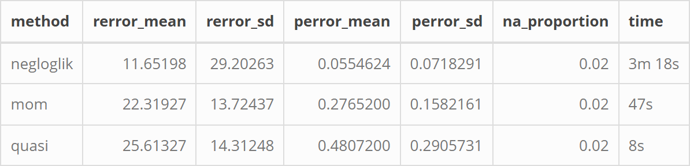
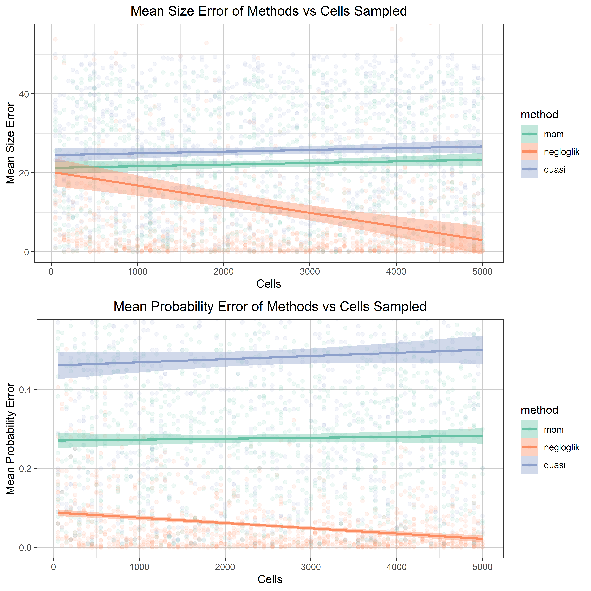

This code evaluates several methods for estimating the parameters of a negative binomial (NB) distribution under varying levels of available data. Gene expression counts in single‑cell RNA‑seq are well modelled by an NB distribution across cells, so by simulating true NB‑distributed gene counts and then attempting to recover their parameters with different estimators, we can directly assess the accuracy and robustness of each method.

A major complication in RNA‑seq data is the variability in sequencing depth across cells. Most protocols capture only a fraction, often around 30%—of the molecules present in each cell. This thinning process can be modelled as binomial sampling applied independently to each gene count in a cell. The resulting count matrix therefore consists of NB‑distributed rows (genes) whose values are further thinned column‑wise (by cell) according to their relative sequencing depths. Because the observed counts no longer follow a standard NB distribution, traditional NB fitting methods fail unless the thinning process is explicitly incorporated into the estimation procedure.

To compare approaches, three different optimisation strategies were used to estimate the NB parameters while accounting for thinning:

* **Negative log likelihood:** This method estimates parameters by maximising the full probability model for the data, making it the most statistically efficient and theoretically correct approach when the model is correctly specified. It directly uses the thinning‑adjusted NB likelihood, so it recovers the true parameters under the assumed generative process.
* **Method of moments:** This approach matches sample moments (mean, variance) to their theoretical counterparts, producing fast but less precise estimates that do not fully use the distributional shape. It is more approximate and can be biased under thinning because it relies only on low‑order summaries of the data.
* **Qusi-likelihood:** This method uses only the mean–variance relationship of the thinned NB model rather than the full probability mass function, giving a compromise between speed and robustness. It captures overdispersion but sacrifices some efficiency compared to full maximum likelihood.

Relative sequencing depth for each cell can be approximated by normalising total counts (sum_depth / mean(sum_depth)) and scaling them to a realistic capture rate (e.g., 0.3 × pred_depth / max(pred_depth)). These values represent relative, not absolute, depths, but they closely track the true thinning probabilities. Their accuracy is illustrated in Figure 0 in *2_Simulations/figs/*.

### Cleaning Up the R Environment

Start by removing all values/plots from the console from previous runs or other R scripts. Edit and delete as appropriate.

```{r cleanup_real, include = FALSE}

# Clear R memory
rm(list=ls())
# Clear console
cat("\014")
# Try to clear plots if there are any
try(dev.off(dev.list()["RStudioGD"]), silent=TRUE)

```

### Setting Up for the Simulation

Import all the libraries needed for the script and defining any custom functions.

```{r setup, message=FALSE, warning=FALSE, results = 'hide'}

# Custom function to install libraries if not installed already, then load
load_library <- function(pkg){
  #' Checks if library installed, installs it if not, then loads the library
  if (!suppressWarnings(require(pkg, character.only = TRUE, quietly = TRUE))) {
    install.packages(pkg, dependencies = TRUE)
    suppressWarnings(library(pkg, character.only = TRUE, quietly = TRUE))
  }
}

# Import libraries needed

# Library for printing f-string-like outputs in R
load_library("glue")

# For formatting tables
load_library("dplyr")
load_library("tidyr")
load_library("stringr")

# For visualising and saving tables
load_library("knitr")
load_library("kableExtra")
load_library("webshot2")

# Libraries for visualising results
# For colour-blind friendly colour palettes 
load_library("RColorBrewer")
# ggplot for creating plots
load_library("ggplot2")
# gridExtra to control plot layout on page
load_library("grid")
load_library("gridExtra")

# Tukey test library
load_library("emmeans")

# Custom MLE functions for the different fitting methods
negloglik_nb_mle <- dget("../1_NB_Methods/negloglik_mle_function.R")
mom_nb_mle       <- dget("../1_NB_Methods/mom_mle_function.R")
quasi_nb_mle     <- dget("../1_NB_Methods/quasi_mle_function.R")
  
# Custom function for formatting time
format_time <- function(dt) {
  #' Function to convert system time into human readable format (h/m/s)
  secs <- as.numeric(dt, units = "secs")
  h <- floor(secs / 3600)
  m <- floor((secs %% 3600) / 60)
  s <- round(secs %% 60)
  if (h > 0) {
    sprintf("%dh %dm %ds", h, m, s)
  } else if (m > 0) {
    sprintf("%dm %ds", m, s)
  } else {
    sprintf("%ds", s)
  }
}
```

The simulation will use randomly generated binomial parameters to create the distributions. The distributions should model how many genes are found in cells. These random parameter values are stored in lists, one for each parameter. There are two NB parameters and a random variation of how many cells to sample from:

* **Size:** Controls the variability of the counts. Will model from 0.1 to 100 to model from very low to very high variability.
* **Probability:** Controls the number of counts (high probability => smaller mean counts). Probability must always be greater than 0 and less than 1.
* **Cells:** How many cells to sample from to model a variety of data availability.

If the file containing these numbers already exists then they will just be taken from it.

In this simulation there will be 1000 NB distributions estimated, one for each gene. A total of 5000 cells will be simulated, from which a random sample of 50-5000 will be used to estimate each gene's parameters. A matrix of the raw 'true' gene counts is created, then a second matrix with the corrupted 'observed' counts based on each cell's sequencing depth. From this matrix the sequencing depths can be estimated.

```{r rng, message=FALSE, warning=FALSE, results = 'hide'}

# Set number of genes and cells to simulate
genes = 1000
cells_total = 5000

# If generated numbers missing, create new ones and save
if (!file.exists("../1_NB_Methods/rng_params.csv")) {
  #set seed to make results replicated each time
  set.seed(1701)
  # Create random samples of parameters
  rngs_df <- data.frame(
    sizes = sample(1:500, genes, replace = TRUE)/10,
    probs = sample(1:99, genes, replace = TRUE)/100,
    cells = sample(1:100, genes,replace = TRUE)*50)
  
  write.csv(rngs_df, "../1_NB_Methods/rng_params.csv", row.names = FALSE)
  
} 

# Read in generated values
rngs_df <- read.csv("../1_NB_Methods/rng_params.csv")

#Save lists of important values for simulations
# The NB parameters
sizes <- rngs_df$sizes[1:genes]
probs <- rngs_df$probs[1:genes]
# How many cells to sample from
cells <- rngs_df$cells[1:genes]

# Generate the sequencing depth for each cell
seq_depth <- sample(1:30, cells_total, replace = TRUE)/100

# Make a matrix of data, where each row is a gene and each column a cell
sim_mat_perf <- t(sapply(seq_along(sizes), function(i) {
  rnbinom(cells_total, size = sizes[i], prob = probs[i])
}))

# Make a matrix where the data has been corrupted based on cell sequencing depth
sim_mat_corr <- sapply(seq_len(ncol(sim_mat_perf)), function(i) {
  rbinom(n = nrow(sim_mat_perf), size = sim_mat_perf[, i], prob = seq_depth[i])
})

# Calculate the total count for each cell
sum_depth  <- colSums(sim_mat_corr)

# Calculate their relative depth
pred_depth <-  (sum_depth / mean(sum_depth)) 
# Assume a maximum depth of 0.3 (just changes scale, relative depth unchanged)
pred_depth <-  0.3*(pred_depth/max(pred_depth)) 

```

### Defining the Methods

Create custom functions for each method. This only needs done if the simulation results are not already stored in a file.

For each method cells takes the count data from the two matrices and uses them to estimate the NB parameters. Results are then returned as a table containing the true parameters, the estimated parameters from the uncorrupted data and the estimated parameters from the observed corrupted data. For this test only the corrupted data will be compared later, as this is the data that most closely reflects the true patterns expected.

```{r methods, message=FALSE, warning=FALSE}

# Check if results files already exist, then no need for functions
if (!file.exists("../1_NB_Methods/multi_cell_results.csv") &
    !file.exists("../1_NB_Methods/multi_cell_means.csv")) {
  
  #---- MLE Negative log likelihood ----
  
  MLE_negloglik <- function(
    sizes, probs, cell_idx, genes, sim_mat_perf, sim_mat_corr, pred_depth
    ) {
    #' function to estimate size and prob parameters of a negative binomial using 
    #' a negative log likelihood MLE
  
    # Create new data frame to save the estimates in
    sim_df <- data.frame(
      method          = "negloglik",
      sizes           = sizes[1:genes],
      probs           = probs[1:genes],
      cells           = cells[1:genes],
      pred_sizes_perf = numeric(genes),
      pred_probs_perf = numeric(genes),
      pred_warns_perf = numeric(genes),
      pred_sizes_corr = numeric(genes),
      pred_probs_corr = numeric(genes),
      pred_warns_corr = numeric(genes),
      zero_prop_corr  = numeric(genes)
    )
    fit_errors_perf = 0
    fit_errors_corr = 0
    
    # Loop through the random parameters
    for (i in 1:genes) {
      
      idx <- cell_idx[[i]]
      
      # ---- UNCORRUPTED FIRST ----
      # While catching any warnings or errors
       fit_samples_perf <- withCallingHandlers(tryCatch({
         # Fit the sampled counts to a negative binomial using maximum likelihood
         negloglik_nb_mle(sim_mat_perf[i, idx])
       },
       # Print out any error messages to highlight the problem
       error = function(e) {
         # Add one to the error count
         fit_errors_perf <- fit_errors_perf + 1
         # Set estimates to NA
         sim_df$pred_sizes_perf[i] <- NA
         sim_df$pred_probs_perf[i] <- NA
         # Return nothing for the fit when an error occurs
         return(NULL)
       }),
       # If there was a warning
       warning = function(w) {
         #log that this step had a warning
         sim_df$pred_warns_perf[i] <<- 1
         # Don't print anything
         invokeRestart("muffleWarning")
       })
        
      # ---- CORRUPTED ----
      # While catching any warnings or errors
       fit_samples_corr <- withCallingHandlers(tryCatch({
         # Fit the sampled counts to a negative binomial using maximum likelihood
         negloglik_nb_mle(sim_mat_corr[i, idx], pred_depth[idx])
       },
       # Print out any error messages to highlight the problem
       error = function(e) {
         # Add one to the error count
         fit_errors_corr <- fit_errors_corr + 1
         # Set estimates to NA
         sim_df$pred_sizes_corr[i] <- NA
         sim_df$pred_probs_corr[i] <- NA
         # Return nothing for the fit when an error occurs
         return(NULL)
       }),
       # If there was a warning
       warning = function(w) {
         #log that this step had a warning
         sim_df$pred_warns_corr[i] <- 1
         # Don't print anything
         invokeRestart("muffleWarning")
       }) 
        
        # If fit_samples isn't null (because there was no error) then save
        if (!is.null(fit_samples_perf)) {
        # Store the predicted parameter estimates
        # Save size as is
        sim_df$pred_sizes_perf[i] <- fit_samples_perf$r_est
        # Calculate probability from size and mean
        sim_df$pred_probs_perf[i] <- fit_samples_perf$p_est
        }
       
        # If fit_samples isn't null (because there was no error) then save
        if (!is.null(fit_samples_corr)) {
        # Store the predicted parameter estimates
        # Save size as is
        sim_df$pred_sizes_corr[i] <- fit_samples_corr$r_est
        # Calculate probability from size and mean
        sim_df$pred_probs_corr[i] <- fit_samples_corr$p_est
        # Also save the proportions of zeroes present in samples
        sim_df$zero_prop_corr[i] <- mean(sim_mat_corr[i, idx] == 0)
        }
       }
      sim_df$error_sizes_perf <- abs(sim_df$sizes - sim_df$pred_sizes_perf)
      sim_df$error_probs_perf <- abs(sim_df$probs - sim_df$pred_probs_perf)
      sim_df$error_sizes_corr <- abs(sim_df$sizes - sim_df$pred_sizes_corr)
      sim_df$error_probs_corr <- abs(sim_df$probs - sim_df$pred_probs_corr)
      
      return(sim_df)
    }
  
  
  #---- MLE Method of Moments ----
  
  MLE_mom <- function(
    sizes, probs, cell_idx, genes, sim_mat_perf, sim_mat_corr, pred_depth
    ) {
    #' function to estimate size and prob parameters of a negative binomial using 
    #' a method of moments based MLE
  
    # Create new data frame to save the estimates in
    sim_df <- data.frame(
      method          = "mom",
      sizes           = sizes[1:genes],
      probs           = probs[1:genes],
      cells           = cells[1:genes],
      pred_sizes_perf = numeric(genes),
      pred_probs_perf = numeric(genes),
      pred_warns_perf = numeric(genes),
      pred_sizes_corr = numeric(genes),
      pred_probs_corr = numeric(genes),
      pred_warns_corr = numeric(genes),
      zero_prop_corr  = numeric(genes)
    )
    fit_errors_perf = 0
    fit_errors_corr = 0
    
    # Loop through the random parameters
    for (i in 1:genes) {
      
      idx <- cell_idx[[i]]
      
      # ---- UNCORRUPTED FIRST ----
      # While catching any warnings or errors
       fit_samples_perf <- withCallingHandlers(tryCatch({
         # Fit the sampled counts to a negative binomial using maximum likelihood
         mom_nb_mle(sim_mat_perf[i, idx])
       },
       # Print out any error messages to highlight the problem
       error = function(e) {
         # Add one to the error count
         fit_errors_perf <- fit_errors_perf + 1
         # Set estimates to NA
         sim_df$pred_sizes_perf[i] <- NA
         sim_df$pred_probs_perf[i] <- NA
         # Return nothing for the fit when an error occurs
         return(NULL)
       }),
       # If there was a warning
       warning = function(w) {
         #log that this step had a warning
         sim_df$pred_warns_perf[i] <<- 1
         # Don't print anything
         invokeRestart("muffleWarning")
       })
        
      # ---- CORRUPTED ----
      # While catching any warnings or errors
       fit_samples_corr <- withCallingHandlers(tryCatch({
         # Fit the sampled counts to a negative binomial using maximum likelihood
         mom_nb_mle(sim_mat_corr[i, idx], pred_depth[idx])
       },
       # Print out any error messages to highlight the problem
       error = function(e) {
         # Add one to the error count
         fit_errors_corr <- fit_errors_corr + 1
         # Set estimates to NA
         sim_df$pred_sizes_corr[i] <- NA
         sim_df$pred_probs_corr[i] <- NA
         # Return nothing for the fit when an error occurs
         return(NULL)
       }),
       # If there was a warning
       warning = function(w) {
         #log that this step had a warning
         sim_df$pred_warns_corr[i] <- 1
         # Don't print anything
         invokeRestart("muffleWarning")
       }) 
        
        # If fit_samples isn't null (because there was no error) then save
        if (!is.null(fit_samples_perf)) {
        # Store the predicted parameter estimates
        # Save size as is
        sim_df$pred_sizes_perf[i] <- fit_samples_perf$r_est
        # Calculate probability from size and mean
        sim_df$pred_probs_perf[i] <- fit_samples_perf$p_est
        }
       
        # If fit_samples isn't null (because there was no error) then save
        if (!is.null(fit_samples_corr)) {
        # Store the predicted parameter estimates
        # Save size as is
        sim_df$pred_sizes_corr[i] <- fit_samples_corr$r_est
        # Calculate probability from size and mean
        sim_df$pred_probs_corr[i] <- fit_samples_corr$p_est
        # Also save the proportions of zeroes present in samples
        sim_df$zero_prop_corr[i] <- mean(sim_mat_corr[i, idx] == 0)
        }
       }
      sim_df$error_sizes_perf <- abs(sim_df$sizes - sim_df$pred_sizes_perf)
      sim_df$error_probs_perf <- abs(sim_df$probs - sim_df$pred_probs_perf)
      sim_df$error_sizes_corr <- abs(sim_df$sizes - sim_df$pred_sizes_corr)
      sim_df$error_probs_corr <- abs(sim_df$probs - sim_df$pred_probs_corr)
      
      return(sim_df)
    }
  
  #---- MLE Quasi-likelihood ----
  
  MLE_quasi <- function(
    sizes, probs, cell_idx, genes, sim_mat_perf, sim_mat_corr, pred_depth
    ) {
    #' function to estimate size and prob parameters of a negative binomial using 
    #' a quasi-likelihood MLE
  
    # Create new data frame to save the estimates in
    sim_df <- data.frame(
      method          = "quasi",
      sizes           = sizes[1:genes],
      probs           = probs[1:genes],
      cells           = cells[1:genes],
      pred_sizes_perf = numeric(genes),
      pred_probs_perf = numeric(genes),
      pred_warns_perf = numeric(genes),
      pred_sizes_corr = numeric(genes),
      pred_probs_corr = numeric(genes),
      pred_warns_corr = numeric(genes),
      zero_prop_corr  = numeric(genes)
    )
    fit_errors_perf = 0
    fit_errors_corr = 0
    
    # Loop through the random parameters
    for (i in 1:genes) {
      
      idx <- cell_idx[[i]]
      
      # ---- UNCORRUPTED FIRST ----
      # While catching any warnings or errors
       fit_samples_perf <- withCallingHandlers(tryCatch({
         # Fit the sampled counts to a negative binomial using maximum likelihood
         quasi_nb_mle(sim_mat_perf[i, idx])
       },
       # Print out any error messages to highlight the problem
       error = function(e) {
         # Add one to the error count
         fit_errors_perf <- fit_errors_perf + 1
         # Set estimates to NA
         sim_df$pred_sizes_perf[i] <- NA
         sim_df$pred_probs_perf[i] <- NA
         # Return nothing for the fit when an error occurs
         return(NULL)
       }),
       # If there was a warning
       warning = function(w) {
         #log that this step had a warning
         sim_df$pred_warns_perf[i] <<- 1
         # Don't print anything
         invokeRestart("muffleWarning")
       })
        
      # ---- CORRUPTED ----
      # While catching any warnings or errors
       fit_samples_corr <- withCallingHandlers(tryCatch({
         # Fit the sampled counts to a negative binomial using maximum likelihood
         quasi_nb_mle(sim_mat_corr[i, idx], pred_depth[idx])
       },
       # Print out any error messages to highlight the problem
       error = function(e) {
         # Add one to the error count
         fit_errors_corr <- fit_errors_corr + 1
         # Set estimates to NA
         sim_df$pred_sizes_corr[i] <- NA
         sim_df$pred_probs_corr[i] <- NA
         # Return nothing for the fit when an error occurs
         return(NULL)
       }),
       # If there was a warning
       warning = function(w) {
         #log that this step had a warning
         sim_df$pred_warns_corr[i] <- 1
         # Don't print anything
         invokeRestart("muffleWarning")
       }) 
        
        # If fit_samples isn't null (because there was no error) then save
        if (!is.null(fit_samples_perf)) {
        # Store the predicted parameter estimates
        # Save size as is
        sim_df$pred_sizes_perf[i] <- fit_samples_perf$r_est
        # Calculate probability from size and mean
        sim_df$pred_probs_perf[i] <- fit_samples_perf$p_est
        }
       
        # If fit_samples isn't null (because there was no error) then save
        if (!is.null(fit_samples_corr)) {
        # Store the predicted parameter estimates
        # Save size as is
        sim_df$pred_sizes_corr[i] <- fit_samples_corr$r_est
        # Calculate probability from size and mean
        sim_df$pred_probs_corr[i] <- fit_samples_corr$p_est
        # Also save the proportions of zeroes present in samples
        sim_df$zero_prop_corr[i] <- mean(sim_mat_corr[i, idx] == 0)
        }
       }
      sim_df$error_sizes_perf <- abs(sim_df$sizes - sim_df$pred_sizes_perf)
      sim_df$error_probs_perf <- abs(sim_df$probs - sim_df$pred_probs_perf)
      sim_df$error_sizes_corr <- abs(sim_df$sizes - sim_df$pred_sizes_corr)
      sim_df$error_probs_corr <- abs(sim_df$probs - sim_df$pred_probs_corr)
      
      return(sim_df)
    }
}

```

### Simulation

Now the actual simulation can be run. To save computing time first the programme will check if a file matching the name of the output file ("multi_cell_results.csv") already exists. If it does then the results will be taken from there.

If the file is not present it will loop through each cell count, running 1000 distribution simulations for each method and randomly sampling the number of cells from them. Each method will estimate the parameters based on the counts in the cells available, and the time this process is completed saved. 

```{r simulation, message=FALSE, warning=FALSE}

# Check if files exist
if (!file.exists("../1_NB_Methods/multi_cell_results.csv") &
    !file.exists("../1_NB_Methods/multi_cell_means.csv")) {
  
  # Create lists for storing  output tables
  results_list <- vector("list", 3)
  
  # Choose which cells to randomly sample from
  cell_idx_list <- lapply(seq_len(genes), function(i) {
    sample(ncol(sim_mat_perf), cells[i])
  })

  
  # Set starting time of loop
  t_0 <- Sys.time()
    
  # ---- MLE Negative log likelihood ----
  # for each gene try to estimate parameters
  df1 <- MLE_negloglik(
    sizes, probs, cell_idx_list, genes, sim_mat_perf, sim_mat_corr
    )
  # Save to results table
  results_list[[1]] <- df1
  # Log the time the estimation finished
  t_1 <- Sys.time()
  print(glue("Negative log likelelihood completed in {format_time(t_1-t_0)}"))
    
  # Now repeat above for each other method
    
  # ---- MLE Method of Moments ----
    
  # Save results to a table
  df2 <- MLE_mom(
    sizes, probs, cell_idx_list, genes, sim_mat_perf, sim_mat_corr
    )
  # Save to results table
  results_list[[2]] <- df2
  # Log the time the estimation finished
  t_2 <- Sys.time()
  print(glue("Method of Moments completed in {format_time(t_2-t_1)}"))
    
  # ---- MLE Quasi-likelihood ----
    
  df3 <- MLE_quasi(
    sizes, probs, cell_idx_list, genes, sim_mat_perf, sim_mat_corr
    )  
  # Save to results table
  results_list[[3]] <- df3
  # Log the time the estimation finished
  t_3 <- Sys.time()
  print(glue("Quasi-likelelihood completed in {format_time(t_3-t_2)}"))
  
  # ---- SUMMARY TABLE ----
  
  sample_results <- dplyr::bind_rows(results_list)
    
  # Create a summary table to store means and other summary metrics
  methods <- unique(sample_results$method)

  sample_means <- data.frame(
    method        = methods,
    rerror_mean   = NA_real_,
    rerror_sd     = NA_real_,
    perror_mean   = NA_real_,
    perror_sd     = NA_real_,
    na_proportion = NA_real_,
    time          = c(format_time(t_1 - t_0),
                      format_time(t_2 - t_1),
                      format_time(t_3 - t_2))
  )

  # Fill summary table
  for (m in seq_along(methods)) {
    sub <- subset(sample_results, method == methods[m])

    sample_means$rerror_mean[m]   <- mean(sub$error_sizes_corr, na.rm = TRUE)
    sample_means$rerror_sd[m]     <- sd(sub$error_sizes_corr, na.rm = TRUE)
    sample_means$perror_mean[m]   <- mean(sub$error_probs_corr, na.rm = TRUE)
    sample_means$perror_sd[m]     <- sd(sub$error_probs_corr, na.rm = TRUE)
    sample_means$na_proportion[m] <- mean(is.na(sub$pred_sizes_corr))
  }
    
  # Save final data frames
  write.csv(sample_means,   "../1_NB_Methods/multi_cell_means.csv",   row.names = FALSE)
  write.csv(sample_results, "../1_NB_Methods/multi_cell_results.csv", row.names = FALSE)
}

# Load results
sample_means   <- read.csv("../1_NB_Methods/multi_cell_means.csv")
sample_results <- read.csv("../1_NB_Methods/multi_cell_results.csv")


```

### Results

Methods can be compared by looking at the last rows of the means summary table, giving an overview of the accuracy and efficiency of each method. Table 1 shows an overview of the mean error, standard deviation, fits failed and time to fit when 10,000 cells are used to estimate parameters.

Table 1 suggests that the negative log likelihood function is the best estimator, having the lowest mean error compared to the other estimators. It does however have a very large standard devaition for size estimates, and is by far the slowest estimator.

```{r summary, message=FALSE, warning=FALSE}

  # Save the table
  save_kable(
    kable(sample_means, format = "html") %>%
      kable_styling(full_width = FALSE, bootstrap_options = "bordered"),
    "../1_NB_Methods/figs/tab_1.png",
    zoom = 2
  )

# Display the table


```

*Table 1: Summary of the mean error and standard deviation of each method, along with error rate and time taken to fit 10,000 cells.*

To get a fuller picture data can be plotted to see how mean error changes across different numbers of cells, to show how cell availability affects which method is best.

First need to rearrange the data into a table ggplot can read, with all errors in one column.

Figure 1 shows that negative log likelihood is always the best estimator for probability, consistently estimating closer to true values. However, when estimating size the number of cells play an important role, with low numbers of cells having worse estimations than higher numbers. This explains the large standard deviation of this estimator. However, it still shows that on average the negative log likelihood is the preferred estimator.

```{r plots, message=FALSE, warning=FALSE}

# If figure not already created, create plot
if (!file.exists("../1_NB_Methods/figs/fig_1.png")){
  
  size_plot <- ggplot(sample_results, aes(x = cells, 
                                          y = error_sizes_corr,
                                          colour = method, fill = method, 
                                          group = method)) +
    geom_point(alpha = 0.1) +
    geom_smooth(
      method = "lm",
      formula = y ~ x,
      se = TRUE
    ) +
    scale_colour_brewer(palette = "Set2") +
    scale_fill_brewer(palette = "Set2") +
    coord_cartesian(ylim = c(0, 55)) +
    labs(
      title = "Mean Size Error of Methods vs Cells Sampled",
      y = "Mean Size Error",
      x = "Cells"
    ) +
    theme_bw() +
    theme(
      panel.grid.major = element_line(colour = "grey80"),
      panel.grid.minor = element_line(colour = "grey90"),
      plot.title = element_text(hjust = 0.5)
    )
  
  prob_plot <- ggplot(sample_results, aes(x = cells, 
                                          y = error_probs_corr, 
                                          colour = method, fill = method, 
                                          group = method)) +
    geom_point(alpha = 0.1) +
    geom_smooth(
      method = "lm",
      formula = y ~ x,
      se = TRUE
    ) +
    scale_colour_brewer(palette = "Set2") +
    scale_fill_brewer(palette = "Set2") +
    coord_cartesian(ylim = c(0, 0.55)) +
    labs(
      title = "Mean Probability Error of Methods vs Cells Sampled",
      y = "Mean Probability Error",
      x = "Cells"
    ) +
    theme_bw() +
    theme(
      panel.grid.major = element_line(colour = "grey80"),
      panel.grid.minor = element_line(colour = "grey90"),
      plot.title = element_text(hjust = 0.5)
    )

  # Plot figure and save to folder
  png("../1_NB_Methods/figs/fig_1.png",
      width = 8, height = 8, units = "in", res = 600)
  grid.newpage()
  grid.arrange(size_plot, prob_plot, ncol = 1)
  dev.off()
}

# Display the plot


```

*Figure 1: plots showing the mean errors of the different methods as cell number increases.*

``` {r lm}

# And just to check that errors actually vary with method
size_fit <- lm(data = sample_results, error_sizes_corr ~ method + cells)
prob_fit <- lm(data = sample_results, error_probs_corr ~ method + cells)

summary(size_fit)
summary(prob_fit)

# And do a tukey to see if negative log lieklihood actually different from rest
pairs(emmeans(size_fit, "method"), adjust = "tukey")
pairs(emmeans(prob_fit, "method"), adjust = "tukey")

```