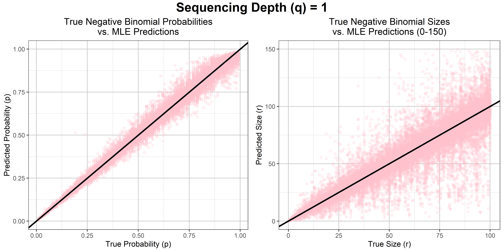
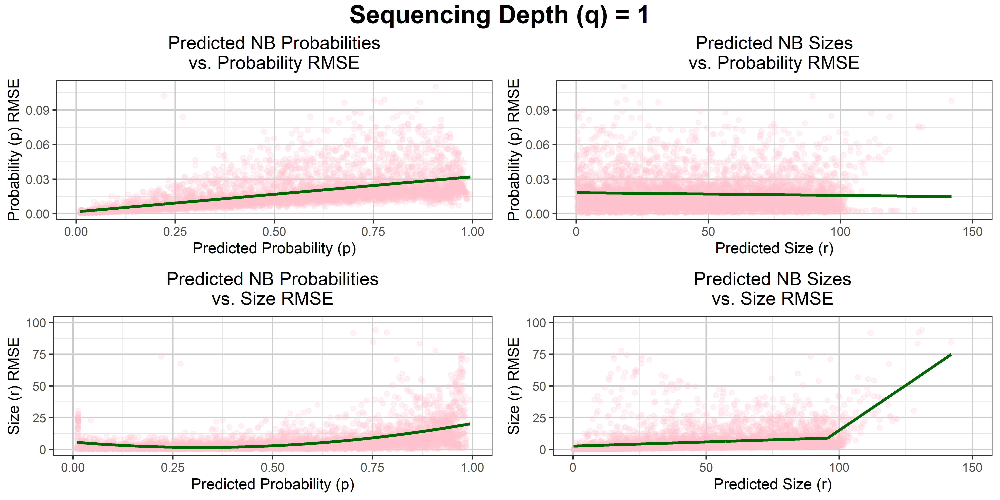
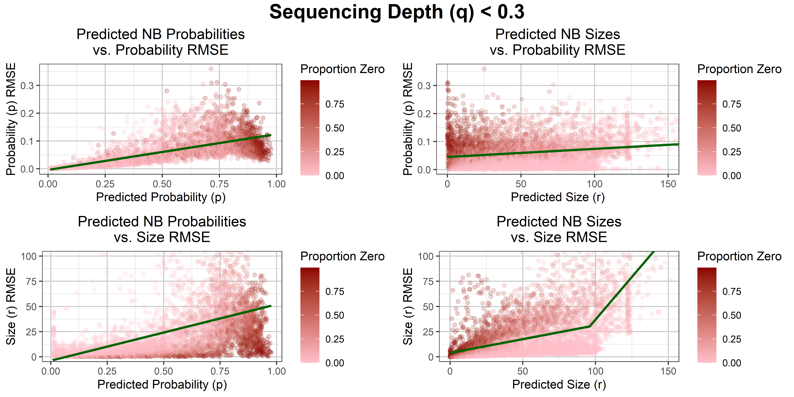
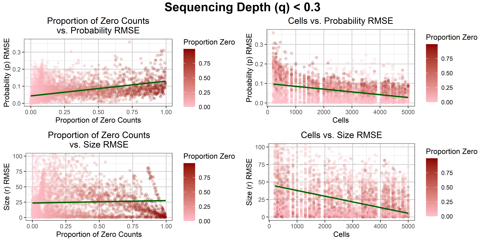

### Setting up

Recommend running the below code to clear the current R environment.

```{r setup, message=FALSE, warning=FALSE}

# Clear R memory
rm(list=ls())
# Clear console
cat("\014")
# Try to clear plots if there are any
try(dev.off(dev.list()["RStudioGD"]), silent=TRUE)

```

Import all the libraries needed for analysis. 

```{r libraries, message=FALSE, warning=FALSE, results='hide'}

# Custom function to install libraries if not installed already, then load
load_library <- function(pkg){
  #' Checks if library installed, installs it if not, then loads the library
  if (!suppressWarnings(require(pkg, character.only = TRUE, quietly = TRUE))) {
    install.packages(pkg, dependencies = TRUE)
    suppressWarnings(library(pkg, character.only = TRUE, quietly = TRUE))
  }
}

# Library for printing f-string-like outputs in R
load_library("glue")

# Libraries for visualising results
# ggplot for creating plots
load_library("RColorBrewer")
load_library("ggplot2")
load_library("segmented")
# gridExtra to control plot layout on page
load_library("grid")
load_library("gridExtra")

# Library to fit error bars and assess parameters
load_library("quantreg")

# Custom MLE function
nb_mle <- dget("../2_Simulations/mle_function.R")

format_time <- function(dt) {
  #' Function to convert system time into human readable format (h/m/s)
  secs <- as.numeric(dt, units = "secs")
  h <- floor(secs / 3600)
  m <- floor((secs %% 3600) / 60)
  s <- round(secs %% 60)
  if (h > 0) {
    sprintf("%dh %dm %ds", h, m, s)
  } else if (m > 0) {
    sprintf("%dm %ds", m, s)
  } else {
    sprintf("%ds", s)
  }
}

```

### Generate Data

Set a seed to randomly generate combinations of sizes, probabilities and cells which will be used to generate and sample from a negative binomial (NB) distribution. The seed means the same values should be generated each time. To be safe, values are saved in the working environment as "rng_params.csv" and imported.


```{r rng, message=FALSE, warning=FALSE, results='hide'}

# Set number of genes and cells to simulate
genes = 5000
cells_total = 5000

file_path <- "../2_Simulations/rng_params.csv"

# If file missing, generate full set
if (!file.exists(file_path)) {
  
  set.seed(1701)
  rngs_df <- data.frame(
    sizes = sample(1:1000, genes, replace = TRUE)/10,
    probs = sample(1:99,   genes, replace = TRUE)/100,
    cells = sample(1:100,  genes, replace = TRUE)*50
  )
  
  write.csv(rngs_df, file_path, row.names = FALSE)

} else {

  # Read existing file
  rngs_df <- read.csv(file_path)

  # If too few rows, generate more and append
  if (nrow(rngs_df) < genes) {
    
    needed <- genes - nrow(rngs_df)
    set.seed(1701)

    extra <- data.frame(
      sizes = sample(1:500, needed, replace = TRUE)/10,
      probs = sample(1:99, needed, replace = TRUE)/100,
      cells = sample(1:100, needed, replace = TRUE) * 50
    )

    rngs_df <- rbind(rngs_df, extra)

    # Save updated file
    write.csv(rngs_df, file_path, row.names = FALSE)
  }
}

# Now safely extract exactly `genes` rows
sizes <- rngs_df$sizes[1:genes]
probs <- rngs_df$probs[1:genes]
cells <- rngs_df$cells[1:genes]


# Generate the sequencing depth for each cell
seq_depth <- sample(1:30, cells_total, replace = TRUE)/100


```

The size and probability values are used to plot NB distributions from which counts for each gene can be drawn. Cell number will determine how many of counts are drawn to simulate variation in the availability of data. An example matrix is created below. 

To model inaccuracies from sequencing methods, the data will be corrupted by varying the sequencing depth of each cell using a binomial (not negative) distribution.
The lower the binomial probability, the lower the sample value should be on average. An example of this is also shown in the code below.


```{r raw_sim, message=FALSE, warning=FALSE}

# Make a matrix of data, where each row is a gene and each column a cell
sim_mat_perf <- t(sapply(seq_along(sizes), function(i) {
  rnbinom(cells_total, size = sizes[i], prob = probs[i])
}))

# Make a matrix where the data has been corrupted based on cell sequencing depth
sim_mat_corr <- sapply(seq_len(ncol(sim_mat_perf)), function(i) {
  rbinom(n = nrow(sim_mat_perf), size = sim_mat_perf[, i], prob = seq_depth[i])
})
```

### Depth Estimation

To estimate the relative sequencing depth for each cell, the total number of sequences in that cell is divided by the mean number of sequences across cells. This is then divided by the max depth to put them on a scale from 0-1, and then multiplied by 0.3 to put it on a realistic sequencing scale that can be compared to the generated depths. The actual depths cannot be known, they are simply relative between cells. The max depth of 0.3 is simply chosen as a realist depth for RNAseq data. Fig 0 shows that this calculation accurately recovers the true relationship between sequencing depths of cells (the scale is just due to us knowing the maximum).


```{r seq_depth, message=FALSE, warning=FALSE}

# Add all the sequence counts for each cell
sum_depth  <- colSums(sim_mat_corr)

# Calculate their relative depth
pred_depth <-  (sum_depth / mean(sum_depth))  # RELATIVE seq depth
pred_depth <-  0.3*(pred_depth/max(pred_depth)) # relative seq depth 0-0.3

# If the comparison plot not already in file system
if (!file.exists("../2_Simulations/figs/fig_0.png")) {
  # Create a data frame so ggplot can access data
  depth_df <- data.frame(
    # Input real depths and predicted depths
    seq_depth  = seq_depth,
    pred_depth = pred_depth
    )
  
  # Compare real and predicted depths by plotting
  png("../2_Simulations/figs/fig_0.png",
      width = 8, height = 5, units = "in", res = 600)
  print(
    ggplot(depth_df, aes(x = seq_depth, y = pred_depth)) +
      geom_point(alpha = 0.5) +
      theme_bw()
    )
  dev.off()
}

# Display the plot
knitr::include_graphics(c(
  "../2_Simulations/figs/fig_0.png"))


```

*Figure 0: Plot showing that the calculations accurately estimate the relationships between sequencing depths of cells based on corrupted gene count data.*

### Running the Simulation

If the data is not already present in a working directory file, then the randomly generated sizes and probabilities will be used to generate a NB distributions from which a random number cells will be sampled from. To allow a standard error to be calculated, each combination of parameters (size, probability, cells and sequencing depths) will be used to generate counts 10 separate times, allowing 10 estimations to be made. Variation in counts will come from the randomness of the NB samples, and the binomial sequencing depth thinning of the counts, resulting in a different list of counts passed to the function to estimate the parameters. The predicted sequencing depths from the entire dataset matrices will be used to accurately preserve the relationship between every estimate, rather than recalculating relative sequencing depths for the subset of cells used. Once all estimations have been completed, they can be saved in a file for future analysis to save re-running the simulation.


```{r simulate, message=FALSE, warning=FALSE}

# If file already exists, skip the simulation
if (!file.exists("../2_Simulations/simulation_df.csv")) {
    t_0 <- Sys.time()
  
  # Create new data frame to save the estimates in
  # Everything repeated 10 times to allow mean SE to be calculated
  sim_df <- data.frame(
    sizes           = rep(sizes, each = 10),
    probs           = rep(probs, each = 10),
    cells           = rep(cells, each = 10),
    pred_sizes_perf = numeric(10*genes),
    pred_probs_perf = numeric(10*genes),
    pred_warns_perf = numeric(10*genes),
    pred_sizes_corr = numeric(10*genes),
    pred_probs_corr = numeric(10*genes),
    pred_warns_corr = numeric(10*genes),
    zero_prop_corr  = numeric(10*genes)
  )
  fit_errors_perf = 0
  fit_errors_corr = 0
  
  # Run through every row
  for (i in 1:(10*genes)){
    
    # Every 10 rows (one chunk of repeats) change seq_depths
    if ((i - 1)%%10 == 0){
      # Choose which index values to use
      idx <- sample (cells_total, sim_df$cells[i])
    }
    
    # Generate data
    # Uncorrupted true counts
    perf_vals <- rnbinom(sim_df$cells[i], 
                         size = sim_df$sizes[i], 
                         prob = sim_df$probs[i])
    # Thinned counts
    corr_vals <- rbinom(n    = sim_df$cells[i], 
                        size = perf_vals, 
                        # Use TRUE sequencing depths
                        prob = seq_depth[idx])
    
    # ---- FIT UNCORRUPTED FIRST ----
    # While catching any warnings or errors
     fit_samples_perf <- withCallingHandlers(tryCatch({
       # Fit the sampled counts to a negative binomial using maximum likelihood
       nb_mle(perf_vals)
     },
     # Print out any error messages to highlight the problem
     error = function(e) {
       # Add one to the error count
       fit_errors_perf <- fit_errors_perf + 1
       # Set estimates to NA
       sim_df$pred_sizes_perf[i] <- NA
       sim_df$pred_probs_perf[i] <- NA
       # Return nothing for the fit when an error occurs
       return(NULL)
     }),
     # If there was a warning
     warning = function(w) {
       #log that this step had a warning
       sim_df$pred_warns_perf[i] <<- 1
       # Don't print anything
       invokeRestart("muffleWarning")
     })
      
    # ---- FIT CORRUPTED ----
    # While catching any warnings or errors
     fit_samples_corr <- withCallingHandlers(tryCatch({
       # Fit the sampled counts to a negative binomial using maximum likelihood
       # This time use the PREDICTED sequencing depths
       nb_mle(corr_vals, pred_depth[idx])
     },
     # Print out any error messages to highlight the problem
     error = function(e) {
       # Add one to the error count
       fit_errors_corr <- fit_errors_corr + 1
       # Set estimates to NA
       sim_df$pred_sizes_corr[i] <- NA
       sim_df$pred_probs_corr[i] <- NA
       # Return nothing for the fit when an error occurs
       return(NULL)
     }),
     # If there was a warning
     warning = function(w) {
       #log that this step had a warning
       sim_df$pred_warns_corr[i] <- 1
       # Don't print anything
       invokeRestart("muffleWarning")
     }) 
     
      # If fit_samples isn't null (because there was no error) then save
      if (!is.null(fit_samples_perf)) {
      # Store the predicted parameter estimates
      # Save size
      sim_df$pred_sizes_perf[i] <- fit_samples_perf$r_est
      # Save probability
      sim_df$pred_probs_perf[i] <- fit_samples_perf$p_est
      }
     
      # If fit_samples isn't null (because there was no error) then save
      if (!is.null(fit_samples_corr)) {
      # Store the predicted parameter estimates
      # Save size
      sim_df$pred_sizes_corr[i] <- fit_samples_corr$r_est
      # Save probability
      sim_df$pred_probs_corr[i] <- fit_samples_corr$p_est
      # Also save the proportions of zeroes present in samples
      sim_df$zero_prop_corr[i] <- mean(corr_vals == 0)
      }
     
     if (i %% round((10*genes)/10,0) == 0) {
       print(glue("Completed {i} loops"))
      }
    }
  t_1 <- Sys.time()
  
  # Print out how many error and warnings occurred
  print(glue("completed {genes} loops in {format_time(t_1-t_0)} with {fit_errors_perf + fit_errors_corr} errors"))

  sim_df$error_sizes_perf <- abs(sim_df$sizes - sim_df$pred_sizes_perf)
  sim_df$error_probs_perf <- abs(sim_df$probs - sim_df$pred_probs_perf)
  sim_df$error_sizes_corr <- abs(sim_df$sizes - sim_df$pred_sizes_corr)
  sim_df$error_probs_corr <- abs(sim_df$probs - sim_df$pred_probs_corr)

  write.csv(sim_df, "../2_Simulations/simulation_df.csv", row.names = FALSE)
} 

# Open the existing file
sim_df <- read.csv("../2_Simulations/simulation_df.csv")


```

Note: original run took 2h 57m 54s to analyse each of 5000 genes 10 times.

Now the data frame is created/imported, the root mean square error can be calculated for each gene.

```{r se_calc, message=FALSE, warning=FALSE}

# Define chunks
chunk <- ceiling(seq_len(nrow(sim_df)) / 10)

# Summarise table by taking mean of each 10 rows
sim_df_means <- aggregate(sim_df, 
                          by = list(chunk), 
                          FUN = function(x) mean(x, na.rm = TRUE))[ ,-1]

# Calculate the root mean square error of each chunk, for each estimated value
sim_df_means$rmse_sizes_perf <- aggregate(
  sim_df$error_sizes_perf,
  by = list(chunk),
  FUN = function(x) {
    x <- x[!is.na(x)]
    sqrt(mean(x^2))
  }
)[ ,-1]
sim_df_means$rmse_probs_perf <- aggregate(
  sim_df$error_probs_perf,
  by = list(chunk),
  FUN = function(x) {
    x <- x[!is.na(x)]
    sqrt(mean(x^2))
  }
)[ ,-1]
sim_df_means$rmse_sizes_corr <- aggregate(
  sim_df$error_sizes_corr,
  by = list(chunk),
  FUN = function(x) {
    x <- x[!is.na(x)]
    sqrt(mean(x^2))
  }
)[ ,-1]
sim_df_means$rmse_probs_corr <- aggregate(
  sim_df$error_probs_corr,
  by = list(chunk),
  FUN = function(x) {
    x <- x[!is.na(x)]
    sqrt(mean(x^2))
  }
)[ ,-1]

```
Finally clean the data by removing any rows containing NA values (where estimation failed) from each data set. This shows that 2.2% of estimates failed, with only 0.1% of genes failing completely across all 10 estimates.

```{r clean_data}

sim_df <- sim_df[complete.cases(sim_df), ]
sim_df_means <- sim_df_means[complete.cases(sim_df_means), ]

```

### Analysing Errors

#### True vs Predicted

First compare the predicted values to their true values for the uncorrupted cell counts (Fig. 1a). Unsurprisingly, error variation seems to increase as true and predicted values grow. 

```{r true_vs_perf, message=FALSE, warning=FALSE}

# If file already exists, skip the plotting
if (!file.exists("../2_Simulations/figs/fig_1a.png")) {
  # Create scatter plot of the predicted vs true probability values
  plot_probs_perf <- ggplot(
    # Specify data to use
    sim_df, aes(x = probs, y = pred_probs_perf)) +
    geom_point(colour = "pink", alpha = 0.2) +
    # Add 1:1 line for reference of where we would hope points lie
    geom_abline(intercept = 0, slope = 1, colour = "black", linewidth = 1) +
    # Set title and axis titles
    labs(
      title = "True Negative Binomial Probabilities\nvs. MLE Predictions",
      x = "True Probability (p)",
      y = "Predicted Probability (p)"
      ) +
    # Set scale, 0-1 as probabilities
    scale_y_continuous(limits = c(0, 1)) +
    # Set theme to preferred type
    theme_bw() +
    # Add gridlines
    theme(
        panel.grid.major = element_line(colour = "grey80"),
        panel.grid.minor = element_line(colour = "grey90"),
        plot.title = element_text(hjust = 0.5)
        )
  
  # Repeat above but with size predictions
  plot_sizes_perf <- ggplot(
      sim_df, aes(x = sizes, y = pred_sizes_perf)) +
      geom_point(colour = "pink", alpha = 0.2) +
      geom_abline(intercept = 0, slope = 1, colour = "black", linewidth = 1) +
      labs(
        title = "True Negative Binomial Sizes\nvs. MLE Predictions (0-150)",
        x = "True Size (r)",
        y = "Predicted Size (r)"
      ) +
      scale_y_continuous(limits = c(0, 150)) +
      theme_bw() +
      theme(
          panel.grid.major = element_line(colour = "grey80"),
          panel.grid.minor = element_line(colour = "grey90"),
           plot.title = element_text(hjust = 0.5)
      )
  
  # Save plots to png
  png("../2_Simulations/figs/fig_1a.png",
      width = 10, height = 5, units = "in", res = 600)
  # Display these graphs side-by-side
  grid.arrange(plot_probs_perf, plot_sizes_perf, ncol=2,
               top = textGrob(
                 "Sequencing Depth (q) = 1",
                 gp = gpar(fontsize = 18, fontface = "bold")
  ))
  dev.off()
}

# Display the plot


```

*Figure 1a: Comparing the true and predicted values of probability (left) and size (right) of the simulated negative binomial distribution without any sequencing errors. Black line shows where true and predicted values are exactly equal*

Compare this to the most corrupted samples (Fig. 1b), which increases the variation/spread in errors but keeps the other patterns the same. With the thinning of gene counts a lot of zeroes are introduced to the gene count data. These are included as an approximate measure of how sequencing depth has affected the data. They appear to be correlated with high probability estimates, low size estimates and underestimations of both these parameters.

(Code hidden in html output to more easily compare as almost identical to last chunk).

```{r true_vs_corr, echo=FALSE, message=FALSE, warning=FALSE, results='asis'}

# If file already exists, skip the plotting
if (!file.exists("../2_Simulations/figs/fig_1b.png")) {
  # Create scatter plot of the predicted vs true probability values
  plot_probs_corr <- ggplot(
    # Specify data to use
    sim_df, aes(x = probs, y = pred_probs_corr)) +
    geom_point(aes(colour = zero_prop_corr), alpha = 0.2) +
    # Add 1:1 line for reference of where we would hope points lie
    geom_abline(intercept = 0, slope = 1, colour = "black", linewidth = 1) +
    # Add colour scale to show how many cells for each point
    scale_colour_gradient(low = "pink", high = "darkred",
                            name = "Zeroes in Data") +
    # Set title and axis titles
    labs(
      title = "True Negative Binomial Probabilities\nvs. MLE Predictions",
      x = "True Probability (p)",
      y = "Predicted Probability (p)"
      ) +
    # Set scale, 0-1 as probabilities
    scale_y_continuous(limits = c(0, 1)) +
    # Set theme to preferred type
    theme_bw() +
    # Add gridlines
    theme(
        panel.grid.major = element_line(colour = "grey80"),
        panel.grid.minor = element_line(colour = "grey90"),
        plot.title = element_text(hjust = 0.5)
        )
  
  # Repeat above but with size predictions
  plot_sizes_corr <- ggplot(
      sim_df, aes(x = sizes, y = pred_sizes_corr)) +
      geom_point(aes(colour = zero_prop_corr), alpha = 0.2) +
      geom_abline(intercept = 0, slope = 1, colour = "black", linewidth = 1) +
      scale_colour_gradient(low = "pink", high = "darkred",
                            name = "Zeroes in Data") +
      labs(
        title = "True Negative Binomial Sizes\nvs. MLE Predictions (0-150)",
        x = "True Size (r)",
        y = "Predicted Size (r)"
      ) +
      scale_y_continuous(limits = c(0, 150)) +
      theme_bw() +
      theme(
          panel.grid.major = element_line(colour = "grey80"),
          panel.grid.minor = element_line(colour = "grey90"),
           plot.title = element_text(hjust = 0.5)
      )
  
  # Save plots to png
  png("../2_Simulations/figs/fig_1b.png",
      width = 10, height = 5, units = "in", res = 600)
  # Display these graphs side-by-side
  grid.arrange(plot_probs_corr, plot_sizes_corr, ncol=2,
               top = textGrob(
                 "Sequencing Depth (q) < 0.3",
                 gp = gpar(fontsize = 18, fontface = "bold")
  ))
  dev.off()
}

# Display the plot
knitr::include_graphics("../2_Simulations/figs/fig_1b.png")

```

*Figure 1b: Comparing the true and predicted values of probability (left) and size (right) of the simulated negative binomial distribution with a sequencing rate of <0.3. Black line shows where true and predicted values are exactly equal. Colour of points represent proportion of zeroes in the gene counts, with darker signifying more.*

#### Errors Across Predicted Values

Next plot the errors of size and probability compared to the predicted values, to explore the relationship between these. This is first done for the uncorrupted data (Fig. 2a). For the probability error there seems to be a very clear linear relationship between the predicted probability values and error, though the size values seem to be rather random. For size error the relationship appears more complex, with higher errors at higher sizes (since true sizes were <= 100).

```{r predicted_vs_error_perf, message=FALSE, warning=FALSE}

error_plot <- function(
    x, y, df,
    segment = FALSE,
    poly = 1,
    title = "", xlab = "", ylab = "",
    corrupted = FALSE,
    xlim = NULL, ylim = NULL
) {

  df_temp <- df

  if (segment) {
    # For segmented(): use raw x, not poly()
    base_formula <- as.formula(paste(y, "~", x))
    base_fit <- lm(base_formula, data = df_temp)

    seg_formula <- as.formula(paste("~", x))
    seg_fit <- segmented(base_fit, seg.Z = seg_formula, npsi = 1)

    df_temp$pred <- predict(seg_fit)

  } else {
    # For smooth curve: use polynomial
    poly_formula <- as.formula(
      paste0(y, " ~ poly(", x, ", ", poly, ")")
    )
    poly_fit <- lm(poly_formula, data = df_temp)
    df_temp$pred <- predict(poly_fit)
  }

  df_sorted <- df_temp[order(df_temp[[x]]), ]

  plot <- ggplot(df_sorted, aes(x = .data[[x]], y = .data[[y]])) +
    labs(title = title, x = xlab, y = ylab) +
    theme_bw() +
    theme(
      panel.grid.major = element_line(colour = "grey80"),
      panel.grid.minor = element_line(colour = "grey90"),
      plot.title = element_text(hjust = 0.5)
    )

  if (!corrupted) {
    plot <- plot + geom_point(colour = "pink", alpha = 0.2)
  } else {
    plot <- plot +
      geom_point(aes(colour = zero_prop_corr), alpha = 0.2) +
      scale_colour_gradient(low = "pink", high = "darkred",
                            name = "Proportion Zero")
  }

  if (!is.null(xlim) && !is.null(ylim)) {
    plot <- plot + coord_cartesian(xlim = c(0, xlim), ylim = c(0, ylim))
  } else if (!is.null(xlim)) {
    plot <- plot + coord_cartesian(xlim = c(0, xlim))
  } else if (!is.null(ylim)) {
    plot <- plot + coord_cartesian(ylim = c(0, ylim))
  }

  plot <- plot +
    geom_line(aes(y = pred), colour = "darkgreen", linewidth = 1)

  return(plot)
}

# If file already exists, skip the plotting
if (!file.exists("../2_Simulations/figs/fig_2a.png")) {
  
  perf_error_probs_probs <- error_plot(x = "pred_probs_perf", 
                                      y = "rmse_probs_perf",
                                      df = sim_df_means, segment = FALSE,
                    title = "Predicted NB Probabilities\nvs. Probability RMSE",
                    xlab = "Predicted Probability (p)",
                    ylab = "Probability (p) RMSE",
                    xlim = 1)
  
  perf_error_probs_sizes <- error_plot(x = "pred_sizes_perf", 
                                      y = "rmse_probs_perf",
                                      df = sim_df_means, segment = FALSE,
                    title = "Predicted NB Sizes\nvs. Probability RMSE",
                    xlab = "Predicted Size (r)",
                    ylab = "Probability (p) RMSE",
                    xlim = 150)
  
  perf_error_sizes_sizes <- error_plot(x = "pred_sizes_perf", 
                                      y = "rmse_sizes_perf",
                                      df = sim_df_means, segment = TRUE,
                    title = "Predicted NB Sizes\nvs. Size RMSE",
                    xlab = "Predicted Size (r)",
                    ylab = "Size (r) RMSE",
                    xlim = 150, ylim = 100)
  
  perf_error_sizes_probs <- error_plot(x = "pred_probs_perf", 
                                      y = "rmse_sizes_perf",
                                      df = sim_df_means, segment = FALSE,
                                      poly = 2,
                    title = "Predicted NB Probabilities\nvs. Size RMSE",
                    xlab = "Predicted Probability (p)",
                    ylab = "Size (r) RMSE",
                    xlim = 1, ylim = 100)

  # Save plots to png
  png("../2_Simulations/figs/fig_2a.png",
      width = 10, height = 5, units = "in", res = 600)
  # Plot all the predicted vs error plots in 2x2 grid
  grid.arrange(perf_error_probs_probs,
               perf_error_probs_sizes,
               perf_error_sizes_probs,
               perf_error_sizes_sizes, 
               ncol=2,
               top = textGrob(
                 "Sequencing Depth (q) = 1",
                 gp = gpar(fontsize = 18, fontface = "bold")
  ))
  dev.off()
}

# Display the plot



```

*Figure 2a: Plots exploring the relationship between root mean square errors (RMSE) and predicted values with no corruption to analyse the patterns between them. Dark green lines represent mean root mean square error.*

Compare to thinned, corrupted estimates (Fig. 2b), which appear to have more linear relationships and (as expected) higher errors. This seems tohave led to stronger relationships between predicted values and errors.

(code again hidden for ease of comparison as similar to above.)

```{r predicted_vs_error_corr, echo=FALSE, message=FALSE, warning=FALSE, results='asis'}

# If file already exists, skip the plotting
if (!file.exists("../2_Simulations/figs/fig_2b.png")) {
  
  corr_error_probs_probs <- error_plot(x = "pred_probs_corr", 
                                      y = "rmse_probs_corr",
                                      df = sim_df_means, segment = FALSE,
                                      corrupted = TRUE,
                    title = "Predicted NB Probabilities\nvs. Probability RMSE",
                    xlab = "Predicted Probability (p)",
                    ylab = "Probability (p) RMSE")
  
  corr_error_probs_sizes <- error_plot(x = "pred_sizes_corr", 
                                      y = "rmse_probs_corr",
                                      df = sim_df_means, segment = FALSE,
                                      corrupted = TRUE,
                    title = "Predicted NB Sizes\nvs. Probability RMSE",
                    xlab = "Predicted Size (r)",
                    ylab = "Probability (p) RMSE",
                    xlim = 150)
  
  corr_error_sizes_sizes <- error_plot(x = "pred_sizes_corr", 
                                      y = "rmse_sizes_corr",
                                      df = sim_df_means, segment = TRUE,
                                      corrupted = TRUE,
                    title = "Predicted NB Sizes\nvs. Size RMSE",
                    xlab = "Predicted Size (r)",
                    ylab = "Size (r) RMSE",
                    xlim = 150, ylim = 100)
  
  corr_error_sizes_probs <- error_plot(x = "pred_probs_corr", 
                                      y = "rmse_sizes_corr",
                                      df = sim_df_means, segment = FALSE,
                                      corrupted = TRUE,
                    title = "Predicted NB Probabilities\nvs. Size RMSE",
                    xlab = "Predicted Probability (p)",
                    ylab = "Size (r) RMSE",
                    ylim = 100)

  # Save plots to png
  png("../2_Simulations/figs/fig_2b.png",
      width = 10, height = 5, units = "in", res = 600)
  # Plot all the predicted vs error plots in 2x2 grid
  grid.arrange(corr_error_probs_probs,
               corr_error_probs_sizes,
               corr_error_sizes_probs,
               corr_error_sizes_sizes, 
               ncol=2,
               top = textGrob(
                 "Sequencing Depth (q) < 0.3",
                 gp = gpar(fontsize = 18, fontface = "bold")
  ))
  dev.off()
}

# Display the plot


```

*Figure 2b: Plots exploring the relationship between root mean square errors (RMSE) and predicted values including corruption to analyse the patterns between them. Dark green lines represent mean root mean square error.*

There are other factors that would be expected to have an effect on errors. Figure 3 shows how cells (the number of counts) and proportion of zeroes (how corrupted the counts are) relate to errors. Cells appear to have a strong negative relationship with error size, while proportion of zereos onle seems to have a positive correlation with probability error, not size.

```{r others_vs_error_corr, echo=FALSE, message=FALSE, warning=FALSE, results='asis'}

# If file already exists, skip the plotting
if (!file.exists("../2_Simulations/figs/fig_3.png")) {
  
  corr_error_probs_zeros <- error_plot(x = "zero_prop_corr", 
                                      y = "rmse_probs_corr",
                                      df = sim_df_means, segment = FALSE,
                                      corrupted = TRUE,
                    title = "Proportion of Zero Counts\nvs. Probability RMSE",
                    xlab = "Proportion of Zero Counts",
                    ylab = "Probability (p) RMSE")
  
  corr_error_probs_cells <- error_plot(x = "cells", 
                                      y = "rmse_probs_corr",
                                      df = sim_df_means, segment = FALSE,
                                      corrupted = TRUE,
                    title = "Cells vs. Probability RMSE",
                    xlab = "Cells",
                    ylab = "Probability (p) RMSE")
  
  corr_error_sizes_cells <- error_plot(x = "cells", 
                                      y = "rmse_sizes_corr",
                                      df = sim_df_means, segment = FALSE,
                                      corrupted = TRUE,
                    title = "Cells vs. Size RMSE",
                    xlab = "Cells",
                    ylab = "Size (r) RMSE",
                    ylim = 100)
  
  corr_error_sizes_zeros <- error_plot(x = "zero_prop_corr", 
                                      y = "rmse_sizes_corr",
                                      df = sim_df_means, segment = FALSE,
                                      corrupted = TRUE,
                    title = "Proportion of Zero Counts\nvs. Size RMSE",
                    xlab = "Proportion of Zero Counts",
                    ylab = "Size (r) RMSE",
                    ylim = 100)

  # Save plots to png
  png("../2_Simulations/figs/fig_3.png",
      width = 10, height = 5, units = "in", res = 600)
  # Plot all the predicted vs error plots in 2x2 grid
  grid.arrange(corr_error_probs_zeros,
               corr_error_probs_cells,
               corr_error_sizes_zeros,
               corr_error_sizes_cells, 
               ncol=2,
               top = textGrob(
                 "Sequencing Depth (q) < 0.3",
                 gp = gpar(fontsize = 18, fontface = "bold")
  ))
  dev.off()
}

# Display the plot


```

*Figure 3: Plots exploring the relationship between errors and predicted values when sequencing rate = 0.2 to analyse the patterns between them. Dark green lines represent 95th percentile threshold, below which 95% of points fall.*

### Modelling Errors in Parameter Space

The final step is to create a model that will calculate the expected root mean square error given specific parameter combinations. This essentially gives a measure of how far away the true parameters likely are for any data. The model will need to include:

* **Predicted Size** obtained by the estimates, ignoring all values over the break point.
* **Predicted Probability** obtained by the estimates, including the hinge point where error increases close to 1.
* **Number of Cells/Samples** Just the length of the counts list.
* **Proportion of Zeroes** Gives a measure of how affected the data has been by sequencing depth.

The reason all values over the break point is ignored for sizes is because that is the point where there aren't enough true values to accurately model errors. Because there are no true values errors are inflated above around size = 100, leading to a large overestimate of errors in the data. This is not reflective of the real relationship since the threshold of 100 was arbitrary, so values in this region should be ignored.

Interactions will also be included in the model, as it is expected that the combinations affect each other.

Before fitting errors to the data, the break points for the size of each sequencing rate are calculated, and values above this rate excluded.  A new table will be created that just contains results not affected by lack of high true values.

```{r bp_calc, message=FALSE, warning=FALSE}

fit <- lm(rmse_sizes_corr ~ pred_sizes_corr, data = sim_df_means)
seg_fit <- segmented(fit, seg.Z = ~ pred_sizes_corr, npsi = 1)

bp <- seg_fit$psi[ , "Est."]

sim_df_bp <- sim_df_means[sim_df_means$pred_sizes_corr <= bp, ]

```

Now this dataset exists, the root mean square errors can be modeled based on all the parameters and their pairwise interactions. From the earlier plots, there are no obvious polynomial relationships that need to be included.

```{r fitting, message=FALSE, warning=FALSE}

# If fits not already created
if (!file.exists("../2_Simulations/error_fit_size.rds") &
    !file.exists("../Simulation/error_fit_prob.rds")) {
  
  # Size error model
  fit_err_size <- lm(data = sim_df_bp,
                     rmse_sizes_corr ~ 
                       (pred_sizes_corr + pred_probs_corr +
                         zero_prop_corr + cells)^2)
  # Probability error model
  fit_err_prob <- lm(data = sim_df_bp,
                     rmse_probs_corr ~ 
                       (pred_sizes_corr + pred_probs_corr +
                         zero_prop_corr + cells)^2)
  
  # Save the models for future fit estimates
  saveRDS(fit_err_size, "../2_Simulations/error_fit_size.rds")
  saveRDS(fit_err_prob, "../2_Simulations/error_fit_prob.rds")
}

# Open fits with readRDS()
fit_err_size <- readRDS("../2_Simulations/error_fit_size.rds")
fit_err_prob <- readRDS("../2_Simulations/error_fit_prob.rds")

# Print summaries
summary(fit_err_size)
summary(fit_err_prob)

```

Finally a grid of parameters can be created to create a contour plot showing how the error rates vary with predicted parameters. For these plots a median sample size and sequencing rate is used for simplicity.

```{r contours, message=FALSE, warning=FALSE}

# If contours not already created
if (!file.exists("../2_Simulations/figs/fig_4a.png") &
    !file.exists("../Simulation/figs/fig_4b.png")) {
  
  # Create example values for probability and size
  grid_length = 250
  p_grid <- seq(0.01, 0.99, length.out = grid_length)
  r_grid <- seq(   1,  150, length.out = grid_length)
  
  # Place these values in a matrix to create a grid of values
  grid <- expand.grid(
    pred_probs_corr = p_grid,
    pred_sizes_corr = r_grid,
    cells           = mean(sim_df$cells),
    zero_prop_corr  = mean(sim_df$zero_prop_corr)
  )
  
  # Use the model to predict 95% error size for each of these grid points
  errprob95 <- abs(predict(fit_err_prob, newdata = grid))
  errsize95 <- abs(predict(fit_err_size, newdata = grid))
  # Convert these predictions into a matrix
  errprob95_mat <- matrix(errprob95, nrow = length(p_grid), ncol = length(r_grid))
  errsize95_mat <- matrix(errsize95, nrow = length(p_grid), ncol = length(r_grid))
  
  # Define the colours
  cols <- colorRampPalette(brewer.pal(3, "Set2"))
  
  # Create the contour plots
  png("../2_Simulations/figs/fig_4a.png",
        width = 8, height = 5, units = "in", res = 600)
  filled.contour(
    x = p_grid,
    y = r_grid,
    z = errsize95_mat,
    color.palette = cols,
    xlab = "Predicted Probability (p)",
    ylab = "Predicted Size (r)",
    main = "Size RMSE Surface",
    plot.axes = {
      axis(1)
      axis(2, at = seq(0, 150, by = 30), labels = seq(0, 150, by = 30))
      }
  )
  dev.off()
  
  png("../2_Simulations/figs/fig_4b.png",
        width = 8, height = 5, units = "in", res = 600)
  filled.contour(
    x = p_grid,
    y = r_grid,
    z = errprob95_mat,
    color.palette = cols,
    xlab = "Predicted Probability (p)",
    ylab = "Predicted Size (r)",
    main = "Probability RMSE Surface",
    plot.axes = {
      axis(1)
      axis(2, at = seq(0, 150, by = 30), labels = seq(0, 150, by = 30))
      }
  )
  dev.off()
}

knitr::include_graphics(c(
  "../2_Simulations/figs/fig_4a.png",
  "../2_Simulations/figs/fig_4b.png"
))

```
*Figure 4: Contour plots displaying how errors increase in parameter space. The root mean square error (RMSE) at each combination of estimated size (r) and probability (p) of a Negative Binomial are plotted, with the mean simulated number of cells and proportion of zeroes.*
