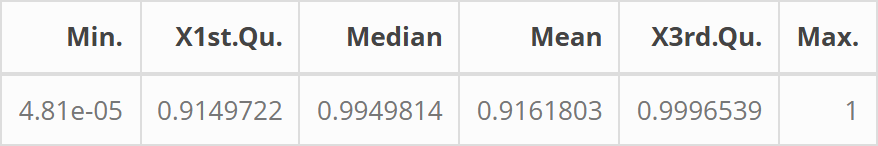

### Setting up

Recommend running the below code to clear the current R environment.

```{r setup, message=FALSE, warning=FALSE}

# Clear R memory
rm(list=ls())
# Clear console
cat("\014")
# Try to clear plots if there are any
try(dev.off(dev.list()["RStudioGD"]), silent=TRUE)

```

Import all the libraries needed for analysis. 

```{r libraries, message=FALSE, warning=FALSE, results='hide'}

# Custom function to install libraries if not installed already, then load
load_library <- function(pkg){
  if (!suppressWarnings(require(pkg, character.only = TRUE, quietly = TRUE))) {
    if (pkg %in% c("rhdf5", "rhdf5filters", "HDF5Array", "SingleCellExperiment")) {
      if (!requireNamespace("BiocManager", quietly = TRUE)) {
        install.packages("BiocManager")
      }
      BiocManager::install(pkg, update = FALSE, ask = FALSE)
    } else {
      install.packages(pkg, dependencies = TRUE)
    }
    suppressWarnings(library(pkg, character.only = TRUE, quietly = TRUE))
  }
}

# Library for handling Seurat object files
load_library("SeuratObject")
load_library("Seurat")

# Library for handling large matrices
load_library("Matrix")

# Library for printing f-string-like outputs in R
load_library("glue")

# For visualising and saving tables
load_library("knitr")
load_library("kableExtra")
load_library("webshot2")

# For colour-blind friendly colour palettes 
load_library("RColorBrewer")
# Library for graphs
load_library("ggplot2")

# gridExtra to control plot layout on page
load_library("grid")
load_library("gridExtra")

# Library to make audible noise
load_library("beepr")

# Library to create heatmaps
load_library("pheatmap")
# Libraries for UpSet plot
load_library("UpSetR")
load_library("ComplexUpset")
# Load API to access STRING
load_library("rbioapi")
# Library to convert STRING image arrays into PNGs
load_library("png")

# Custom function for estimating parameters
load_library("devtools")
devtools::load_all("../estimator_function")

format_time <- function(dt) {
  #' Function to convert system time into human readable format (h/m/s)
  secs <- as.numeric(dt, units = "secs")
  h <- floor(secs / 3600)
  m <- floor((secs %% 3600) / 60)
  s <- round(secs %% 60)
  if (h > 0) {
    sprintf("%dh %dm %ds", h, m, s)
  } else if (m > 0) {
    sprintf("%dm %ds", m, s)
  } else {
    sprintf("%ds", s)
  }
}

```
### Preparing Data

First load RDS file downloaded from [https://zenodo.org/records/14511579](https://zenodo.org/records/14511579). This is an R formatted cell by gene matrix including all the metadata needed for this study, so minimal changes are needed.

This file takes a long time to load and filter later so if the filtered data already created then will just load that later.

```{r load_data, message=FALSE, warning=FALSE}

# If none of the files saved on disk (all need data to be created)
if (!all(
  file.exists("../3_Real_Data/filt_count_mat.rds"),
  file.exists("../3_Real_Data/filt_meta_cell.rds"),
  file.exists("../3_Real_Data/filt_patient_data.csv")
)) {
  
  # Read raw data file
  data <- readRDS(
    "../3_Real_Data/merged_tissue_cluster_update_filt_other_mal_4.RDS")
  
  # Create map to rename cancers to be more human friendly
  cancer_map <- c(
    "Melanoma_derived_brain_metastases" = "Brain",
    "Basal_Cell_Carcinoma"              = "Carcinoma",
    "Melanoma"                          = "Melanoma",
    "HER2+"                             = "Breast_(HER2+)",
    "TNBC"                              = "Breast_(TNBC)",
    "ER+"                               = "Breast_(ER+)",
    "HCC"                               = "Liver_(HCC)",
    "iCCA"                              = "Liver_(iCCA)",
    "ccRCC"                             = "Kidney"
  )
}

```

One additional thing needed is the relative sequencing depth of each cell. This is used to standardise the count data from each cell to correct for different sequencing depths. The relative depth is estimated to be the total number of sequences of each cell divided by the mean across all cells. This is then standardised to be between 0 and 0.3 to approximate the true range expected for sequencing depths.

This analysis will compare gene expression across:

* Cancer types (of which there are 9 in this study).
* Before and after ICB therapy (pre vs post).

Combinations of these labels result in 2 different cell classifications (pre and post in each cancer type). Every cell in the data set is assigned to one of these categories so that differences between them can be compared. 

This left the dataset with 8 groups, 4 cancers with both pre and post therapy sampled cells.


```{r meta_table, warning=FALSE}

# If the data has not already been filtered
if (!(file.exists("../3_Real_Data/filt_count_mat.rds") && 
      file.exists("../3_Real_Data/filt_meta_cell.rds"))) {

  # Extract the parameters that will be used for this study
  # Cell will always be needed for any study
  # Cancer type will likely be of interest for comparisons in most studies
  # patient ID and pre-post are specific to this study
  meta_cell <- data.frame(
    cell        = colnames(data),
    id          = data$donor_id,
    cancer_type = data$Cancer_type,
    pre_post    = data$pre_post,
    stringsAsFactors = FALSE
  )
  
  # Apply new names
  meta_cell$cancer_type <- cancer_map[meta_cell$cancer_type]
  
  # Create a matrix of all count data
  count_mat <- data[["RNA"]]@counts
  
  # Label each cell based on what cancer-treatment combination it matches
  meta_cell$group_label <- paste0(meta_cell$cancer_type, "_", meta_cell$pre_post)
  # Create a list of these groups
  group_levels <- unique(meta_cell$group_label)
  
  # Save number of genes
  G <- nrow(count_mat)
  # Save number of cells
  C <- ncol(count_mat)
}

```
Now the data will be cleaned to remove poorly sequenced cells and genes from the data. Looking at the data the data is generally poor quality, with very high proportions of zeroes. Therefore, only cells with counts that are more than 95% zeroes will be excluded. Additionally, any gene with counts made up of more than 95% percent zeroes in any group will be removed from all groups so that the remaining gene parameters can be compared between all groups.

```{r cell_clean, warning=FALSE}


# If the data has not already been filtered
if (!(file.exists("../3_Real_Data/filt_count_mat.rds") && 
      file.exists("../3_Real_Data/filt_meta_cell.rds"))) {

  # Count nonzeroes per column
  nonzero_per_cell <- diff(count_mat@p)
  # Calculate zero proportion per cell
  cell_zero_global <- (G - nonzero_per_cell) / G
  # Check what the distribution of proportions look like
  cell_zero_summary <- data.frame(as.list(summary(cell_zero_global)))
  # Display
  cell_zero_summary
  
  # Clean cells
  # Since low quality, will exclude above 95%
  cells_to_keep <- cell_zero_global <= 0.95

  # Apply cell filter
  count_mat_a <- count_mat[, cells_to_keep]
  meta_cell_a <- meta_cell[cells_to_keep, ]

  # inform how many removed
  message("Removed ", sum(!cells_to_keep),
          " cells (global zero proportion > 95%).")

  # Recompute group labels AFTER cell filtering 
  group_levels_a <- unique(meta_cell_a$group_label)
  
  # Save the summary table
  save_kable(
    kable(cell_zero_summary, format = "html") %>%
      kable_styling(full_width = FALSE, bootstrap_options = "bordered"),
    "../3_Real_data/figs/tab_1.png",
    zoom = 2
  )

} else {
  
  # If a saved summary table of zero proportions across cells exists display it
  if (file.exists("../3_Real_data/figs/tab_1.png")){
    # Display the table
    knitr::include_graphics("../3_Real_data/figs/tab_1.png")
  }
}

```

*Table 1: Proportions of zeroes found in cells across whole data set.*

After cleaning also remove any patients who didn't contribute cells both pre and post therapy. Final filtered data sets are saved to cut down on computational time for any repeated runs.

```{r gene_clean, warning=FALSE}


# If the data has not already been filtered
if (!(file.exists("../3_Real_Data/filt_count_mat.rds") && 
      file.exists("../3_Real_Data/filt_meta_cell.rds"))) {  
  
  # Check gene means  
  nonzero_per_gene <- Matrix::rowSums(count_mat_a != 0)
  gene_zero_global <- 1 - (nonzero_per_gene / ncol(count_mat_a))
  # Check what the distribution of proportions look like
  gene_zero_summary <- data.frame(as.list(summary(gene_zero_global)))
  # Display
  gene_zero_summary
  
  # Calculate proportion by group
  gene_zero_prop_by_group <- sapply(group_levels_a, function(g) {
    cols_g <- meta_cell_a$group_label == g
    ng <- sum(cols_g)
    
    # number of nonzero counts per gene in this group
    nz <- Matrix::rowSums(count_mat_a[, cols_g, drop = FALSE] != 0)

    # proportion of zeroes
    1 - (nz / ng)
  })
  
  # Mark genes to keep
  genes_to_keep <- apply(gene_zero_prop_by_group <= 0.95, 1, all)

  message("Removed ", sum(!genes_to_keep),
          " genes (>95% zeroes in at least one group).")


  # Apply gene filter
  count_mat_b <- count_mat_a[genes_to_keep, ]
  meta_cell_b <- meta_cell_a

  # Remove patients lacking both Pre and Post cells
  tab <- table(meta_cell_b$id, meta_cell_b$pre_post)
  valid_ids <- rownames(tab)[tab[, "Pre"] > 0 & tab[, "Post"] > 0]
  # Apply filter
  filt_meta_cell <- meta_cell_b[meta_cell_b$id %in% valid_ids, ]
  filt_count_mat <- count_mat_b[, filt_meta_cell$cell]

  # Final group labels
  filt_meta_cell$group_label <- paste0(
    filt_meta_cell$cancer_type, "_", filt_meta_cell$pre_post
  )
  
  # Save the summary table
  save_kable(
    kable(gene_zero_summary, format = "html") %>%
      kable_styling(full_width = FALSE, bootstrap_options = "bordered"),
    "../3_Real_Data/figs/tab_2.png",
    zoom = 2
  )

  # Save results
  saveRDS(filt_count_mat, "../3_Real_Data/filt_count_mat.rds")
  saveRDS(filt_meta_cell, "../3_Real_Data/filt_meta_cell.rds")
  
} else {
  
  # If files do exist then just load them
  filt_count_mat <- readRDS("../3_Real_Data/filt_count_mat.rds")
  filt_meta_cell <- readRDS("../3_Real_Data/filt_meta_cell.rds")
  
  # Also if zero proportions by gene table exists then show this
  # Note this is already AFTER low quality cells removed
  if (file.exists("../3_Real_Data/figs/tab_2.png")){
    # Display the table
    
  }
}
 
# Create list of group labels based on filtered data
group_levels_filt <- unique(filt_meta_cell$group_label)

# Split filtered matrix
mat_list <- lapply(group_levels_filt, function(g) {
  cols <- filt_meta_cell$group_label == g
  filt_count_mat[, cols, drop = FALSE]
})

# Name the matrices based on their group
names(mat_list) <- group_levels_filt

```
Calculate the relative sequencing depth of the remaining cells.

```{r seq_depth, message=FALSE, warning=FALSE}

# Estimate q value for each remaining cell:
# Sum all the columns
seq_sum  <- colSums(filt_count_mat)

# Calculate:
seq_depth <-  (seq_sum / mean(seq_sum))  # RELATIVE seq depth
# Normalise:
seq_depth <-  0.3*(seq_depth/max(seq_depth)) # relative seq depth 0-0.3

# Create a list of sequencing depths for each group
seq_depth_list <- lapply(group_levels_filt, function(g) {
  cols <- filt_meta_cell$group_label == g
  seq_depth[cols]
})

# Assign sequencing depths to their respective group
names(seq_depth_list) <- group_levels_filt


```

Create a function that will return a table of negative binomial estimates for a given matrix of gene and cell counts. This utilises the custom function nb_matrix which returns a list of parameter estimates and error predictions while accounting for relative sequencing depth.

```{r estimate_function, warning=FALSE}

# Create a list of all genes
genes = rownames(filt_count_mat)

# Create a function that will let each matrix be input seperately 
# and results table created
generate_estimates <- function(mat, seq_depth = NULL, 
                               save_df = FALSE, filename = NULL){
  #' Function to create results table of gene parameter estimates for a 
  #' given matrix, with option to save table.
  
  # Make note of start time
  t_0 <- Sys.time()
  
  # Estimate parameters and errors using custom function
  # NOTE use '?nb_matrix' to see documentation
  ests <- nb_matrix(
                      mat,
                      seq_depth = seq_depth,
                      # Include error estimates
                      rmse = TRUE,
                      size_rmse_file = "../2_Simulations/error_fit_size.rds",
                      prob_rmse_file = "../2_Simulations/error_fit_prob.rds")
  # Save estimates to table
  est_df <- data.frame(
    genes      = genes,
    r_est      = ests$r_est,
    p_est      = ests$p_est,
    r_rmse     = ests$r_rmse,
    p_rmse     = ests$p_rmse,
    zero_prop  = ests$zero_prop 
  )
  # If save is TRUE
  if (save_df) {
    # If no file name specified
    if (is.null(filename)){
      # Name after matrix
      filename = deparse(substitute(mat))
    } 
    
    # Save table to correct folder
    write.csv(est_df,
              paste0("../3_Real_Data/",filename), 
              row.names = FALSE)
  }
  # Make note of end time
  t_1 <- Sys.time()
  # Print complete
  print(glue("{length(genes)} genes took {format_time(t_1-t_0)} to run"))
  
  # Return the results table
  return(est_df) 
}

```
Use the above function on each filtered matrix. These take a long time so results are saved so as not to need re-runs. A sound (beep) is used to indicate when a run is done.

``` {r estimate_car_pre, warning = FALSE}

# If file does not already exist
if (!file.exists("../3_Real_Data/results/car_pre.csv")){ 
  # Use above function to run analysis
  res_car_pre <- generate_estimates(mat       = mat_list$Carcinoma_Pre,
                                    seq_depth = seq_depth_list$Carcinoma_Pre, 
                                    save_df   = TRUE, 
                                    filename  = "results/car_pre.csv")
  # Make noise to alert user when done
  beep(5)
  
} else {
  
  # If file already exists then just load it
  res_car_pre <- read.csv("../3_Real_Data/results/car_pre.csv")
}

```
other tables hidden as just repeats. They were run separately purely to save computer from having issues from large analysis runs continuously. If running on server could probably run all in a loop, or instead add breaks and quality checks between each loop. 

(I already killed my laptop giving it too much to do earlier in this project so I chose to run these separately to avoid damaging my last available personal computer).

#### Time Taken for Each Group:

**Carcinoma:**
* **Pre:** 30m 8s
* **Post:** 40m 59s

**Breast (HER2+):**
* **Pre:** 3m 44s
* **Post:** 17m 28s

**Breast (TNBC):**
* **Pre:** 46m 28s 
* **Post:** 1h 7m 49s

**Breast (ER+)**
* **Pre:** 1h 7m 35s
* **Post:** 1h 8m 16s

As these times show, even though all analysis is done on the same number of genes, the number of cells in each group plays a large part in the time taken to estimate parameters.

``` {r estimate_car_post, echo=FALSE, warning=FALSE, results='asis'}

if (!file.exists("../3_Real_Data/results/car_post.csv")){ 
  
  res_car_post <- generate_estimates(mat      = mat_list$Carcinoma_Post,
                                    seq_depth = seq_depth_list$Carcinoma_Post, 
                                    save_df   = TRUE, 
                                    filename  = "results/car_post.csv")
  beep(5)
  
} else {
  
  res_car_post <- read.csv("../3_Real_Data/results/car_post.csv")
}

```
``` {r estimate_breast_h_pre, echo=FALSE, warning=FALSE, results='asis'}

if (!file.exists("../3_Real_Data/results/breast_h_pre.csv")){ 
  
  res_breast_h_pre <- generate_estimates(mat  = mat_list$`Breast_(HER2+)_Pre`,
                                    seq_depth = 
                                      seq_depth_list$`Breast_(HER2+)_Pre`, 
                                    save_df   = TRUE, 
                                    filename  = "results/breast_h_pre.csv")
  beep(5)
  
} else {
  
  res_breast_h_pre <- read.csv("../3_Real_Data/results/breast_h_pre.csv")
}

```
``` {r estimate_breast_h_post, echo=FALSE, warning=FALSE, results='asis'}

if (!file.exists("../3_Real_Data/results/breast_h_post.csv")){ 
  
  res_breast_h_post <- generate_estimates(mat = mat_list$`Breast_(HER2+)_Post`,
                                    seq_depth = 
                                      seq_depth_list$`Breast_(HER2+)_Post`, 
                                    save_df   = TRUE, 
                                    filename  = "results/breast_h_post.csv")
  beep(5)
  
} else {
  
  res_breast_h_post <- read.csv("../3_Real_Data/results/breast_h_post.csv")
}

```
``` {r estimate_breast_t_pre, echo=FALSE, warning=FALSE, results='asis'}

if (!file.exists("../3_Real_Data/results/breast_t_pre.csv")){ 
  
  res_breast_t_pre <- generate_estimates(mat  = mat_list$`Breast_(TNBC)_Pre`,
                                    seq_depth = 
                                      seq_depth_list$`Breast_(TNBC)_Pre`, 
                                    save_df   = TRUE, 
                                    filename  = "results/breast_t_pre.csv")
  beep(5)
  
} else {
  
  res_breast_t_pre <- read.csv("../3_Real_Data/results/breast_t_pre.csv")
}

```
``` {r estimate_breast_t_post, echo=FALSE, warning=FALSE, results='asis'}

if (!file.exists("../3_Real_Data/results/breast_t_post.csv")){ 
  
  res_breast_t_post <- generate_estimates(mat = mat_list$`Breast_(TNBC)_Post`,
                                    seq_depth = 
                                      seq_depth_list$`Breast_(TNBC)_Post`, 
                                    save_df   = TRUE, 
                                    filename  = "results/breast_t_post.csv")
  beep(5)
  
} else {
  
  res_breast_t_post <- read.csv("../3_Real_Data/results/breast_t_post.csv")
}

```
``` {r estimate_breast_e_pre, echo=FALSE, warning=FALSE, results='asis'}

if (!file.exists("../3_Real_Data/results/breast_e_pre.csv")){ 
  
  res_breast_e_pre <- generate_estimates(mat  = mat_list$`Breast_(ER+)_Pre`,
                                    seq_depth = 
                                      seq_depth_list$`Breast_(ER+)_Pre`, 
                                    save_df   = TRUE, 
                                    filename  = "results/breast_e_pre.csv")
  beep(5)
  
} else {
  
  res_breast_e_pre <- read.csv("../3_Real_Data/results/breast_e_pre.csv")
}

```
``` {r estimate_breast_e_post, echo=FALSE, warning=FALSE, results='asis'}

if (!file.exists("../3_Real_Data/results/breast_e_post.csv")){ 
  
  res_breast_e_post <- generate_estimates(mat = mat_list$`Breast_(ER+)_Post`,
                                    seq_depth = 
                                      seq_depth_list$`Breast_(ER+)_Post`, 
                                    save_df   = TRUE, 
                                    filename  = "results/breast_e_post.csv")
  beep(5)
  
} else {
  
  res_breast_e_post <- read.csv("../3_Real_Data/results/breast_e_post.csv")
}

```
Once all done any genes that failed can be removed from all groups. Even with some cleaning steps some genes may fail if there aren't many cells in the group.

```{r res_check, message=FALSE, warning=FALSE}

# Save all the result table names to a vector
res_names <- c(
  "res_car_pre",
  "res_car_post",
  "res_breast_h_pre",
  "res_breast_h_post",
  "res_breast_t_pre",
  "res_breast_t_post",
  "res_breast_e_pre",
  "res_breast_e_post"
)

# Create a list of all result tables
res_table <- mget(res_names)

# For each result table add the relevant metadata
for (n in names(res_table)) {
  df <- res_table[[n]]
  # Extract the cancer_time name
  nm <- sub("^res_", "", n)     # remove "res_"
  # Split on the "_" 
  parts <- strsplit(nm, "_")[[1]]
  # Take the last part as time (pre or post)
  time   <- parts[length(parts)]
  # Cancer is everything EXCEPT the last part
  # if multiple add "_" back (for the breast cancers)
  cancer <- paste(parts[-length(parts)], collapse = "_")
  
  # Add these as columns
  df$cancer <- cancer
  df$time   <- time
  
  # Update original data frame
  res_table[[n]] <- df
}

# Collapse all results into one data frame
res_table <- do.call(rbind, res_table)

# Create filtered map to only update remaining cancers
cancer_map_res <- c(
  "car"      = "Carcinoma",
  "breast_h" = "Breast_(HER2+)",
  "breast_t" = "Breast_(TNBC)",
  "breast_e" = "Breast_(ER+)"
)

# Apply new names
res_table$cancer <- cancer_map_res[res_table$cancer]

# Do same to the original result tables
for (n in res_names) {
  df <- get(n)

  # parse cancer + time again for printing
  nm <- sub("^res_", "", n)
  parts <- strsplit(nm, "_")[[1]]

  time   <- parts[length(parts)]
  cancer <- paste(parts[-length(parts)], collapse = "_")

  cancer_pretty <- cancer_map_res[cancer]
  label <- paste0(cancer_pretty, "_", time)

  n_complete <- sum(complete.cases(df))
  rm(df)
  print(glue("{label}:  \t{n_complete} genes estimated"))
}

```
Clean results by removing any genes that failed to get estimates. This is mostly due to breast HER2+ having few cells compared to other groups, resulting in some genes failing. All other groups were complete. 

```{r res_clean, message=FALSE, warning=FALSE}

# Remove any genes not found in every group
genes_to_remove <- unique(res_table$genes[!complete.cases(res_table)])
res_table <- res_table[!res_table$genes %in% genes_to_remove, ]

# Print message to note how many removed
print(glue(
  "Removed {length(genes_to_remove)} genes from data for incomplete estimates"
  ))

```
Now negative binomial estimates are finalised, can convert them into burst kinetics. A gene's expression can be described by it's burstiness (b), or how many copies are typically transcribed, and it's likelihood of being off (k). Because only relative sequencing depth is used these estimates are also relative and cannot be taken as exact values. Another custom function is used to convert these, using the equations:

k = r
b = (1-p)/(p^2)

```{r burst_calc, message=FALSE, warning=FALSE}

# Use a custom function to calculate estimated burst parameters
kb_res <- kb_calc(res_table$r_est, 
                  res_table$p_est,
                  res_table$r_rmse, 
                  res_table$p_rmse)

# Save burst parameters to results
res_table$k_est  <- kb_res$k_est
res_table$k_rmse <- kb_res$k_rmse
res_table$b_est  <- kb_res$b_est
res_table$b_rmse <- kb_res$b_rmse

```

Now a pairwise analysis can be utilised to quantify the difference between pre and post treatment. This is done by assigning a z-score calculated by dividing the difference between estimates by the squareroot of the difference between the errors squared. The fold change and direction of change are also noted in a new results data frame.

```{r analysis_func, message=FALSE, warning=FALSE}

pairwise_test <- function(df1, df2) {
  #' Function to calculate test statistics for k (rate at which a gene 
  #' switches from off to on) and b (burst size, how many copies created while 
  #' on) between pre and post treatment for a cancer. Also calculates 
  #' proportional fold-change in estimated k and b as well as direction.
  
  # merge by gene
  m <- merge(df1, df2, by = "genes", suffixes = c("_1", "_2"))

  # k differences
  dk  <- m$k_est_2/m$k_est_1
  sek <- sqrt(m$k_rmse_1^2 + m$k_rmse_2^2)
  zk  <- (m$k_est_1 - m$k_est_2) / sek

  # b differences
  db  <- m$b_est_2/m$b_est_1
  seb <- sqrt(m$b_rmse_1^2 + m$b_rmse_2^2)
  zb  <- (m$b_est_1 - m$b_est_2) / seb

  # direction
  k_dir <- ifelse(dk > 1, 1, ifelse(dk < 1, -1, 0))
  b_dir <- ifelse(db > 1, 1, ifelse(db < 1, -1, 0))
  
  # Save result in new data frame
  data.frame(
    genes  = m$genes,
    cancer = df1$cancer,
    diff_k = dk,
    z_k    = zk,
    k_dir  = k_dir,
    diff_b = db,
    z_b    = zb,
    b_dir  = b_dir,
    stringsAsFactors = FALSE
  )
}


```
Apply the pairwise analysis to compare pre and post treatment in each cancer.

```{r pairwise analysis, message=FALSE, warning=FALSE}

# Create list to save pairwise results in
pairwise_results <- list()

# Carcinoma
pairwise_results$Carcinoma <- pairwise_test(
  res_table[res_table$cancer == "Carcinoma"      & res_table$time == "pre", ],
  res_table[res_table$cancer == "Carcinoma"      & res_table$time == "post", ]
  )
#Breast (HER2+)
pairwise_results$"Breast_(HER2+)" <- pairwise_test(
  res_table[res_table$cancer == "Breast_(HER2+)" & res_table$time == "pre", ],
  res_table[res_table$cancer == "Breast_(HER2+)" & res_table$time == "post", ]
  )
#Breast (TNBC)
pairwise_results$"Breast_(TNBC)" <- pairwise_test(
  res_table[res_table$cancer == "Breast_(TNBC)"  & res_table$time == "pre", ],
  res_table[res_table$cancer == "Breast_(TNBC)"  & res_table$time == "post", ]
  )
#Breast (ER+)
pairwise_results$"Breast_(ER+)" <- pairwise_test(
  res_table[res_table$cancer == "Breast_(ER+)"   & res_table$time == "pre", ],
  res_table[res_table$cancer == "Breast_(ER+)"   & res_table$time == "post", ]
  )

# Collapse results lists into one table
pairwise_table <- do.call(rbind, pairwise_results)

```

To avoid the problem of multiple testing, the z-scores will be assigned p-values. The list of p-values will then undergo a Benjamin-Hochberg (BH) adjustment to give adjusted p-values to correct for the many tests being run and thereby control the false discovery rate. These adjusted p-values will indicate the likelihood of a z-score as extreme as observed.

```{r BH_corr, message=FALSE, warning=FALSE}

# convert z-scores into p-values
pairwise_table$p_k <- 2 * pnorm(-abs(pairwise_table$z_k))
pairwise_table$p_b <- 2 * pnorm(-abs(pairwise_table$z_b))

# Apply correction for multiple testing
pairwise_table$p_k_adj <- p.adjust(pairwise_table$p_k, method = "BH")
pairwise_table$p_b_adj <- p.adjust(pairwise_table$p_b, method = "BH")

# Update pairwise results to match this information in list
pairwise_results <- split(pairwise_table, pairwise_table$cancer)

```
Now genes that display significantly different expression have been identified, Some analysis can be done to identify any patterns. First, a heat map of fold change in all genes (Fig 1a) and significant genes (Fig 1b).

```{r heatmaps_all, message=FALSE, warning=FALSE}

# Function to create a matrix containing the fold value of all genes
make_fc_matrix <- function(df_list, value_col) {
  # List of all genes
  all_genes <- unique(unlist(lapply(df_list, function(x) x$genes)))
  # List of cancers
  cancers   <- names(df_list)
  # Empty matrix gene x cancer in size
  mat <- matrix(NA, nrow = length(all_genes), ncol = length(cancers),
                dimnames = list(all_genes, cancers))
  # For each cancer retrieve fold values
  for (c in cancers) {
    df <- df_list[[c]]
    mat[df$genes, c] <- df[[value_col]]
  }
  # Return the matrix
  mat
}

# Apply this function to create matrix for each parameter
# Convert to log 2 for clarity
k_fc_mat <- log2(make_fc_matrix(pairwise_results, "diff_k"))
b_fc_mat <- log2(make_fc_matrix(pairwise_results, "diff_b"))

# Define row order based on burstiness (more changes)
row_order_full <- hclust(dist(b_fc_mat))$order
genes_full_ordered <- rownames(b_fc_mat)[row_order_full]
cancers_ordered <- colnames(b_fc_mat)

# Apply order to both matrices
k_fc_mat <- k_fc_mat[genes_full_ordered, ]
b_fc_mat <- b_fc_mat[genes_full_ordered, ]

# Define matrix limits
k_lim <- max(abs(log2(pairwise_table$diff_k)))
b_lim <- max(abs(log2(pairwise_table$diff_b)))
par_lim <- max(c(k_lim, b_lim))

# Set colours to colour blind friendly palette
upset_pal <- brewer.pal(2, "Dark2")
upset_col <- colorRampPalette(c(upset_pal[2], "white", upset_pal[1]))(50)
# Define breaks for colour changes
breaks <- seq(-par_lim, par_lim, length.out = 50)

# Combine matrices
# Build combined column order by appending cancer names
combined_cols <- unlist(lapply(cancers_ordered, function(c) {
    c(paste0(c, "_k"), paste0(c, "_b"))
}))

# Column-bind k and b for each cancer
combined_mat <- do.call(cbind, lapply(cancers_ordered, function(c) {
    cbind(k_fc_mat[, c], b_fc_mat[, c])
}))
# Rename columns
colnames(combined_mat) <- combined_cols


# Plot heatmap of all genes
pheatmap(combined_mat,
         cluster_rows = FALSE,
         cluster_cols = FALSE,
         show_rownames = FALSE,
         color = upset_col,
         breaks = breaks,
         main = "Combined k & b Fold-change (log2) — Pre vs Post Treatment")

```

*Figure 1a: Heatmap of fold-change across all genes.*

```{r heatmaps_sig, message=FALSE, warning=FALSE}

# Create list of all significant genes
sig_union <- unique(pairwise_table$genes[pairwise_table$p_k_adj < 0.05 |
                                           pairwise_table$p_b_adj < 0.05])

# Create table with only these genes
sig_union_table <- pairwise_table[pairwise_table$genes %in% sig_union, ]

# Mask non-significant values separately for k and b
sig_union_table$diff_k <- ifelse(sig_union_table$p_k_adj < 0.05,
                                 sig_union_table$diff_k,
                                 1)
sig_union_table$diff_b <- ifelse(sig_union_table$p_b_adj < 0.05,
                                 sig_union_table$diff_b,
                                 1)

# Split by cancer
sig_union_list_k <- split(sig_union_table, sig_union_table$cancer)
sig_union_list_b <- sig_union_list_k  

# Build matrices
sig_k_mat <- log2(make_fc_matrix(sig_union_list_k, "diff_k"))
sig_b_mat <- log2(make_fc_matrix(sig_union_list_b, "diff_b"))

# Apply consistent gene and cancer order
sig_order <- genes_full_ordered[genes_full_ordered %in% sig_union]
sig_k_mat <- sig_k_mat[sig_order, cancers_ordered]
sig_b_mat <- sig_b_mat[sig_order, cancers_ordered]

# Combine matrices into one
sig_combined_mat <- do.call(cbind, lapply(cancers_ordered, function(c) {
    cbind(sig_k_mat[, c], sig_b_mat[, c])
}))
colnames(sig_combined_mat) <- combined_cols

# Plot all genes that are significant in at least one group
pheatmap(sig_combined_mat,
         cluster_rows = FALSE,
         cluster_cols = FALSE,
         show_rownames = FALSE,
         color = upset_col,
         breaks = breaks,
         main = "Combined k & b Fold-change (log2) — Significant Genes")


```

*Figure 1b: Heatmap of fold-change across genes that are significant in at least one group parameter.*

Can also check how cancer-specific each significant gene is by comparing with an upset plot (Figs 2a and 2b). These are like Venn Diagrams but can be clearer for higher order data.

```{r upset, message=FALSE, warning=FALSE}

# Create table of significant k results
sig_k_only <- sig_union_table[sig_union_table$p_k_adj < 0.05, ]

# Make a list of which genes are significant in each cancer
listInput_k <- list(
  Carcinoma        = sig_k_only$genes[
    sig_k_only$cancer == "Carcinoma"],
  'Breast_(HER2+)' = sig_k_only$genes[
    sig_k_only$cancer == "Breast_(HER2+)"],
  'Breast_(TNBC)'  = sig_k_only$genes[
    sig_k_only$cancer == "Breast_(TNBC)"],
  'Breast_(ER+)'   = sig_k_only$genes[
    sig_k_only$cancer == "Breast_(ER+)"]
)

# Repeat above for b
sig_b_only <- sig_union_table[sig_union_table$p_b_adj < 0.05, ]
listInput_b <- list(
  Carcinoma        = sig_b_only$genes[
    sig_b_only$cancer == "Carcinoma"],
  'Breast_(HER2+)' = sig_b_only$genes[
    sig_b_only$cancer == "Breast_(HER2+)"],
  'Breast_(TNBC)'  = sig_b_only$genes[
    sig_b_only$cancer == "Breast_(TNBC)"],
  'Breast_(ER+)'   = sig_b_only$genes[
    sig_b_only$cancer == "Breast_(ER+)"]
)

# Convert lists to data frames
upset_df_k <- fromList(listInput_k)
upset_df_b <- fromList(listInput_b)

# Pass these data frames to plots
ComplexUpset::upset(
  upset_df_k,
  intersect = colnames(upset_df_k),
  base_annotations = list(
    'Intersection size' = intersection_size(
      bar_color = "steelblue",
      fill = "steelblue"
    )
  )
) +
  theme(
    text = element_text(size = 14),
    axis.text.x = element_text(angle = 45, hjust = 1),
    panel.background = element_rect(fill = "white"),
    plot.background = element_rect(fill = "white")
  )
```

*Figure 2a: Comparison of how many genes have significant switch-off chance (k) change across cancers.*

```{r upset_b, message=FALSE, warning=FALSE}

# Repeat plot for other parameter
ComplexUpset::upset(
  upset_df_b,
  intersect = colnames(upset_df_b),
  base_annotations = list(
    'Intersection size' = intersection_size(
      bar_color = "steelblue",
      fill = "steelblue"
    )
  )
) +
  theme(
    text = element_text(size = 14),
    axis.text.x = element_text(angle = 45, hjust = 1),
    panel.background = element_rect(fill = "white"),
    plot.background = element_rect(fill = "white")
  )

```

*Figure 2b: Comparison of how many genes have significant burst (b) change across cancers.*

Finally look up ontology information using the STRING API. Start by mapping the genes to their STRING IDs.

```{r string_start, message=FALSE, warning=FALSE}

mapped_string_genes <- rba_string_map_ids(
  ids     = unique(c(sig_k_only$genes, sig_b_only$genes)),
  species = 9606  
)

sig_k_only$stringId <- mapped_string_genes$stringId[ match(sig_k_only$genes, 
                                           mapped_string_genes$queryItem) ]

sig_b_only$stringId <- mapped_string_genes$stringId[ match(sig_b_only$genes, 
                                           mapped_string_genes$queryItem) ]

```

Next look up all the groups large enough to get enrichment information. Save plots.

```{r string_enrichment, message=FALSE, warning=FALSE}

string_car_b_up <- sig_b_only$stringId[
  sig_b_only$cancer == "Carcinoma" & 
    !is.na(sig_b_only$stringId) &
    sig_b_only$diff_b > 1
]
string_car_b_down <- sig_b_only$stringId[
  sig_b_only$cancer == "Carcinoma" & 
    !is.na(sig_b_only$stringId) &
    sig_b_only$diff_b < 1
]

writePNG(rba_string_enrichment_image(
  ids     = string_car_b_down,
  species = 9606), 
  "../3_Real_Data/figs/string_enrichment_b_car_down.png")

writePNG(rba_string_enrichment_image(
  ids     = string_car_b_up,
  species = 9606), 
  "../3_Real_Data/figs/string_enrichment_b_car_up.png")

string_breast_h_b_up <- sig_b_only$stringId[
  sig_b_only$cancer == "Breast_(HER2+)" & 
    !is.na(sig_b_only$stringId) &
    sig_b_only$diff_b > 1
]

writePNG(rba_string_enrichment_image(
  ids     = string_breast_h_b_up,
  species = 9606), 
  "../3_Real_Data/figs/string_enrichment_b_breast_h_up.png")

```

For smaller groups that failed to retrieve significant enrichment results simply plot the network. Save results again.

```{r string_network, message=FALSE, warning=FALSE}

# CARCINOMA -----
# k param 
string_car_k <- sig_k_only$stringId[
  sig_k_only$cancer == "Carcinoma" & 
    !is.na(sig_k_only$stringId)
]

writePNG(rba_string_network_image(
  ids     = string_car_k,
  species = 9606
  ), 
  "../3_Real_Data/figs/string_network_k_car.png")

# BREAST HER2+ -----
# b param upregulated
string_breast_h_b_up <- sig_b_only$stringId[
  sig_b_only$cancer == "Breast_(HER2+)" & 
    !is.na(sig_b_only$stringId) &
    sig_b_only$diff_b < 1
]
writePNG(rba_string_network_image(
  ids     = string_breast_h_b_up,
  species = 9606
  ), 
  "../3_Real_Data/figs/string_network_b_breast_h_down.png")

# k param 
string_breast_h_k <- sig_k_only$stringId[
  sig_k_only$cancer == "Breast_(HER2+)" & 
    !is.na(sig_k_only$stringId) 
]
writePNG(rba_string_network_image(
  ids     = string_breast_h_k,
  species = 9606
  ), 
  "../3_Real_Data/figs/string_network_k_breast_h.png")

# BREAST TNBC -----
# b param 
string_breast_t_b <- sig_b_only$stringId[
  sig_b_only$cancer == "Breast_(TNBC)" & 
    !is.na(sig_b_only$stringId) 
]
writePNG(rba_string_network_image(
  ids     = string_breast_t_b,
  species = 9606
  ), 
  "../3_Real_Data/figs/string_network_b_breast_t.png")

# k param 
string_breast_t_k <- sig_k_only$stringId[
  sig_k_only$cancer == "Breast_(TNBC)" & 
    !is.na(sig_k_only$stringId) 
]
writePNG(rba_string_network_image(
  ids     = string_breast_t_k,
  species = 9606
  ), 
  "../3_Real_Data/figs/string_network_k_breast_t.png")

# BREAST ER+ -----
# no b param 

# k param 
string_breast_e_k <- sig_k_only$stringId[
  sig_k_only$cancer == "Breast_(ER+)" & 
    !is.na(sig_k_only$stringId) 
]
writePNG(rba_string_network_image(
  ids     = string_breast_e_k,
  species = 9606
  ), 
  "../3_Real_Data/figs/string_network_k_breast_t.png")

```
Finally analyse patient information (Fig 3). This was to see who results could be applied to, but all studies included in this analysis did not include patient sex or ethnicity. However, for the breast studies while no sex information was included, women make up more than 99% of cases so this is likely reflected in the samples. Ethnicity is not reported, study took place in Belgium which is majority white. Similarly, for Carcinoma the data is from Stanford, USA, a predominantly white area. They did state both male and female patients were included, but did not disclose the percentages.

```{r sex_ethnic_analysis, message=FALSE, warning=FALSE, fig.width=12, fig.height=6}

# If the patient information doesn't exist
if (!file.exists("../3_Real_Data/filt_patient_data.csv")) {
  
  # Create new table of patient information
  patient_table <- data.frame(
    id          = data$donor_id,
    cancer_type = data$Cancer_type,
    outcome     = data$Combined_outcome,
    sex         = data$Sex,
    ethnicity   = data$self_reported_ethnicity_ontology_term_id,
    stringsAsFactors = FALSE
  )
  
  # Filter out repeated rows
  patient_table <- unique(patient_table)
  # Define valid IDs
  valid_ids <- unique(filt_meta_cell$id)
  # Remove any patients not in dataset
  patient_table <- patient_table[patient_table$id %in% valid_ids, ]
  
  # Update cancer types to human readible format
  patient_table$cancer_type <- cancer_map[ patient_table$cancer_type ]
  
  # Define ethnicity map for this dataset
  ethnicity_map <- c(
    "HANCESTRO:0005" = "European",
    "HANCESTRO:0008" = "Asian",
    "HANCESTRO:0568" = "African American",
    "Unknown"        = "Unknown"
  )
  # Apply ethnicity mapping to meta_cell
  patient_table$ethnicity <- ethnicity_map[ patient_table$ethnicity]
  
  # Save table
  write.csv(patient_table, "../3_Real_Data/filt_patient_data.csv", row.names = FALSE)

} else {
  
  # Open existing table
  patient_table <- read.csv("../3_Real_Data/filt_patient_data.csv")
}

# Plot the sex and ethnicity information
sex_plot <- ggplot(patient_table, aes(x = cancer_type, fill = sex)) +
  geom_bar() +
  theme_minimal(base_size = 14) +
  scale_y_continuous(
    limits = c(0, 20),
    breaks = seq(0, 20, by = 5),        
    minor_breaks = seq(0, 20, by = 1)    
  ) +
  theme(panel.grid.major = element_line(color = "grey40"),
        panel.grid.minor = element_line(color = "grey70"),
        panel.grid.major.x = element_blank(),
        axis.text.x = element_text(angle = 45, hjust = 1))

ethnicity_plot <- ggplot(patient_table, aes(x = cancer_type, fill = ethnicity)) +
  geom_bar() +
  theme_minimal(base_size = 14) +
  scale_y_continuous(
    limits = c(0, 20),
    breaks = seq(0, 20, by = 5),        
    minor_breaks = seq(0, 20, by = 1)    
  ) +
  theme(panel.grid.major = element_line(color = "grey40"),
        panel.grid.minor = element_line(color = "grey70"),
        panel.grid.major.x = element_blank(),
        axis.text.x = element_text(angle = 45, hjust = 1))

grid.arrange(sex_plot, ethnicity_plot, ncol = 2)


```

*Figure 3: Patient sex and ethnicity information*